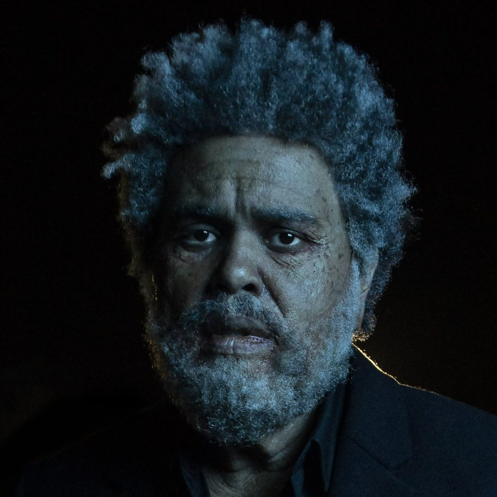
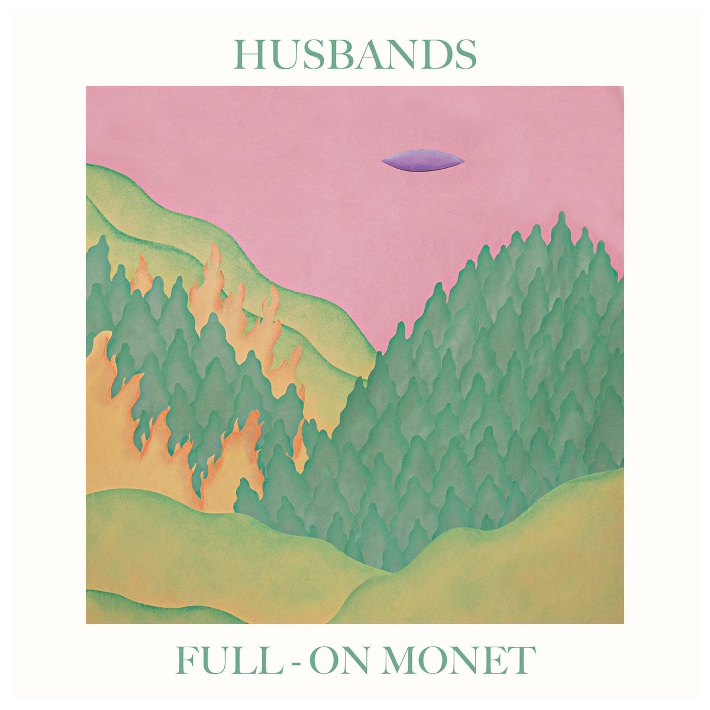
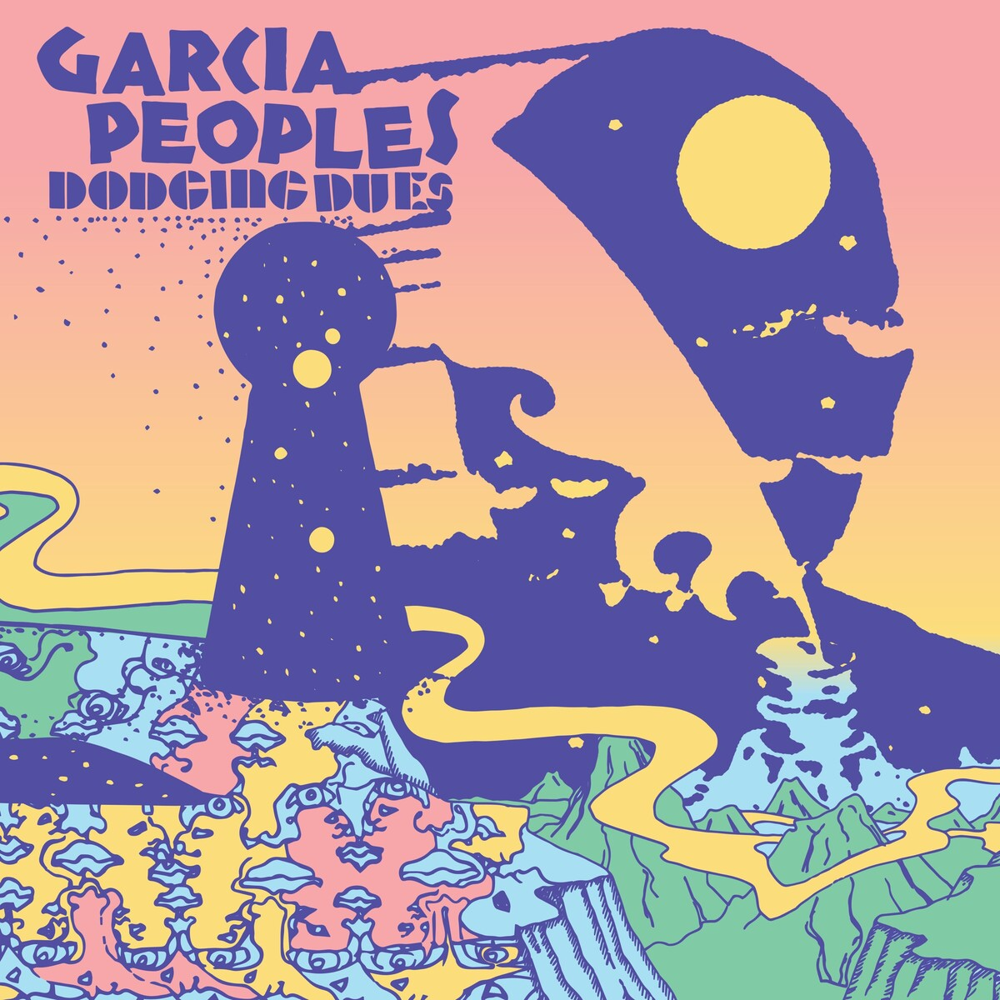
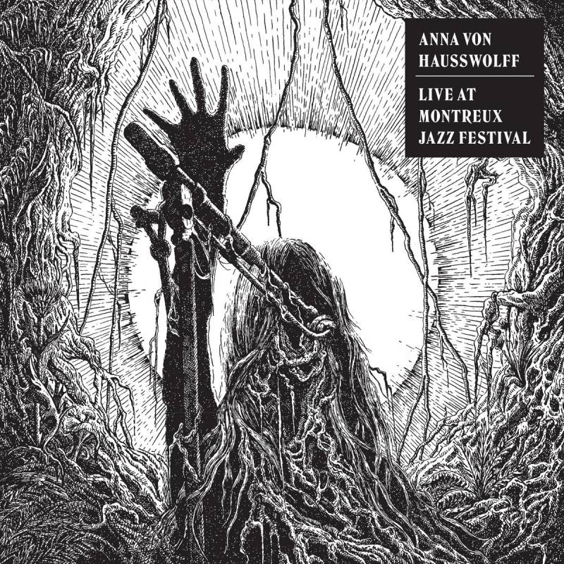

#### Décembre-janvier pourrait s'apparenter au creux de la vague épidémiologique. Après de longs mois agités, on se retrouve dans cette période spéciale où la cadence des grosses sorties ralentie doucement, avant de repartir très lentement dans les premières semaines de l'année. Plus que jamais en janvier 2021, où l'incertitude planait. Cette année, un artiste mainstream a décidé de s'y aventurer (parce que _fuck it_) et, comme toujours, quelques noms plus confidentiels sont heureusement là pour occuper ce mois timide avec leurs beaux projets. Retour sur les meilleurs.

<!--more-->

## Dawn FM - The Weeknd

Après avoir lâché un teaser et sa liste pimpante de guests (Jim Carrey, Oneohtrix Point Never, Tyler, The Creator, Lil Wayne, Quincy Jones), The Weeknd en a probablement eu tout aussi marre que nous de patienter. Il aura fallu à peine attendre le 7 janvier pour se manger la première secousse de 2022 : Dawn FM. L'album, plus impacté que jamais par le désir de cinéma d'Abdel Tesfaye, nous invite dans un afterlife terriblement jouissif narré par l'unique Jim Carrey. Quelques part entre le Michael Jackson de Thriller et les explorations des Daft Punk, The Weeknd livre ici probablement son album le plus abouti sur tous les points.

https://youtu.be/VafTMsrnSTU

## Live At Montreux Jazz Festival - Anna von Hausswolff

Si vous aussi, comme moi, vous n'aviez jamais pris la peine de laisser trainer une oreille sur les réalisations de la Suédoise Anna von Hausswolff avant la récente désespérante polémique impactant sa tournée, il est temps de remédier à ça. Ce nouvel album, Live At Montreux Jazz Festival, est un bon point d'entrée puisqu'il reprend le meilleur du meilleur, à savoir des compositions de Dead Magic paru en 2018 et de The Miraculous de 2015. L'univers de l'artiste n'est pas perméable à tous, mais pour ceux réceptifs, c'est d'une beauté sans nom. De longues plages d'orgue se fondent derrière les envolées lyriques de von Hausswolff, explosant parfois dans de grands feu d'artifices cacophoniques jubilatoires. Ça fout les poils et ça donne très envie de prendre un billet pour une prochaine date.

https://youtu.be/bn91mW2XLn8

## Archive Material - Silverbacks

En 2020, les Irlandais de Silverbacks faisaient leurs premiers pas avec un premier album, Fad, plein de promesses. Venu jouer dans la cour du grand fourre-tout estampillé post-punk, le groupe se démarquait par ses ses sorties de routes plus calmes, son indie-rock ciselé et son groove. Silverbacks passe désormais à la vitesse supérieure avec une signature chez Full Time Hobby pour la sortie de Archive Material. Un deuxième essai davantage plébiscité, et à juste titre. Silverbacks réintègre sa formule initiale en affinant encore plus la forme, sur des airs parfois très talkingheadsiens. Coup de cœur pour l'entêtant « Different Kind of Holiday ».

https://youtu.be/VAAKjfsFQBs

## Full-On Monet - Husbands

Nouvelle sortie qui vient animer les vendredi de ce début 2021, il s'agit du duo de l'Oklahoma Husbands avec son troisième album, Full-On Monet, disponible depuis le 18 janvier. Un nouvel album, apprend-on, composé pendant les mois les plus sombres de 2020, et qui pourtant dégage une douceur et une légèreté assez déconcertante. Aussi apaisant que les tons de la pochette, la musique du groupe s'aventure principalement vers une indie pop à dominance synthétique et aux mélodies aériennes. Mais en réalité, le disque offre un mélange des genres qui saute d'un titre à l'autre et qui fait la force de Full-On Monet. Mention particulière pour les morceaux très efficaces « Ancient One » et « Must Be A Cop ».

https://youtu.be/sP2epcjvXNo

## Dodging Dues - Garcia Peoples

Le collectif de six musiciens du New Jersey Garcia Peoples parlera avec son nouvel album Dodging Dues aux amateurs de sonorités rétro. Articulé autour de seulement sept titres pour un peu plus d'une bonne petite demi-heure, le disque arpente des contrées prog rock et psychédéliques à coup de compositions lentes et électriques. Des riffs musclés et des harmonies bien placées, qui ne réinventeront probablement pas le genre, mais qu'on laisse volontiers nous emporter. Surtout sur « Tough Freaks ».

https://youtu.be/Xnu\_N26t6XA

## Bit Rot - Soft As Snow

Probablement la formation la plus méconnue ici, Soft As Snow est un duo norvégien basé a Berlin qui est du genre à pousser les expérimentations aux extrêmes. Bit Rot est un projet déstabilisant où se succèdent de subtiles tentatives synth-pop portées par la voix de Oda Egjar Starheim, régulièrement désamorcées par des excroissances hyper-pop et autres explorations électroniques créant un climat oppressant. Comme si la machine essayait constamment de reprendre le dessus et de faire dérailler les éléments du réel. Certains y retrouveront une filiation avec le groupe Purity Ring. Il en résulte donc ce deuxième album suffisamment bien dosé pour challenger l'auditeur tout en restant terriblement efficace.

https://youtu.be/uUpBlIsoVJk

## 4Play - Ant Clemons (EP)

En 2018, Ant Clemons faisait son entrée par la grande porte grâce à Kanye West, incorporant sa démo de « All Mine » sur son album ye, avant de l'inviter à nouveau sur Jesus Is King. L'artiste a pu capitaliser sur ce coup de projecteur en sortant son premier EP « HAPPY 2 BE THERE », comptant tout simplement Timbaland, Ty Dolla $ign et Pharrell, et terminant nommé aux Grammys. Clemons revient en 2021 avec un EP très court de 4 titres, mais plus inspiré que jamais. On y retrouve un R&B aérien et downtempo que l'intéressé semble maitriser à la perfection. Pas de démonstration de force ici, mais de belles compositions soulful où l'Américain et ses invités viennent nous susurrer des mots doux à l'oreille entre toutes ces harmonies très réussies. On attend désormais le grand album qu'on mérite.

https://youtu.be/a1es6ewBWRs

Et comme toujours, la playlist Sonne Qui Peut, avec tous ces artistes à retrouver et plus encore :

https://open.spotify.com/playlist/7KvmElAbF9ISe5YRkfHGlW?si=1247206c321a4c66
