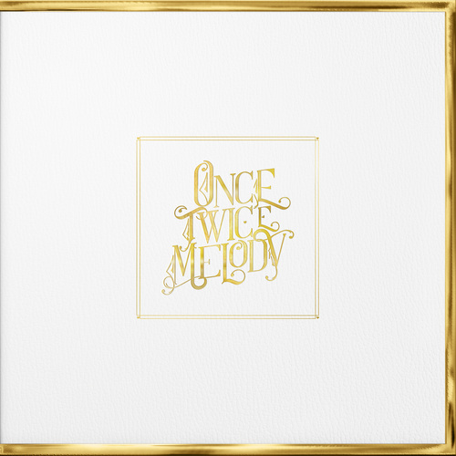
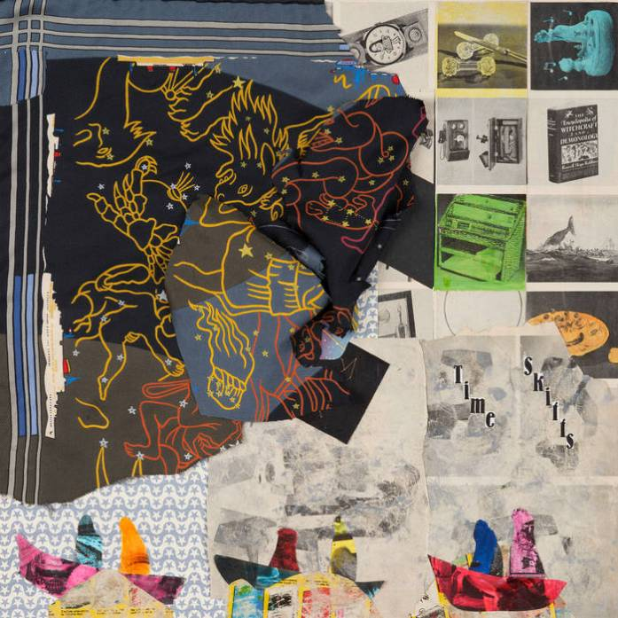
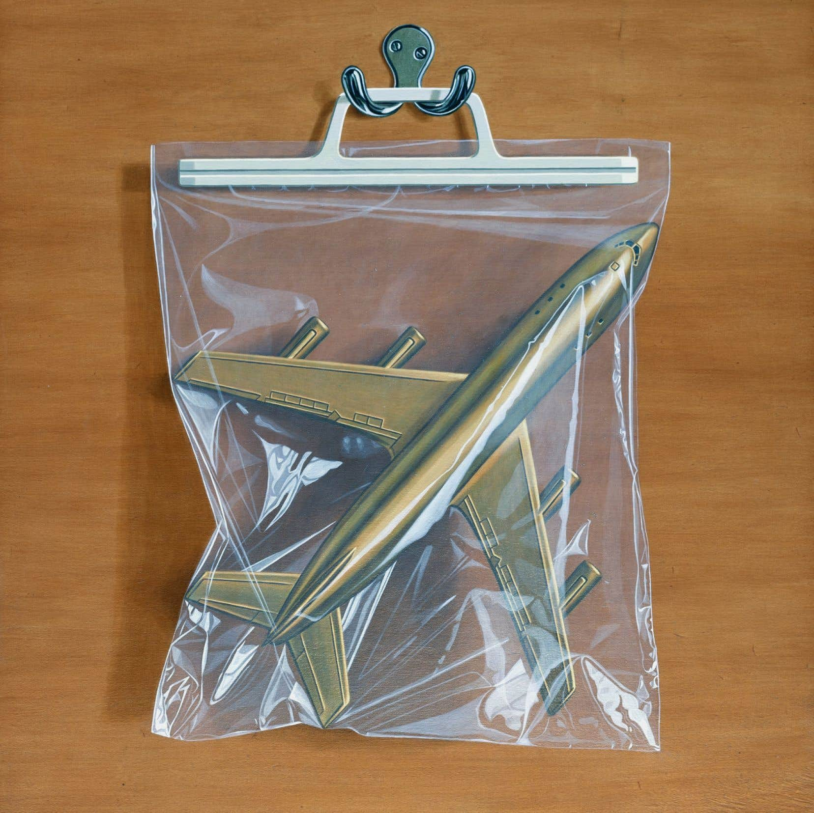
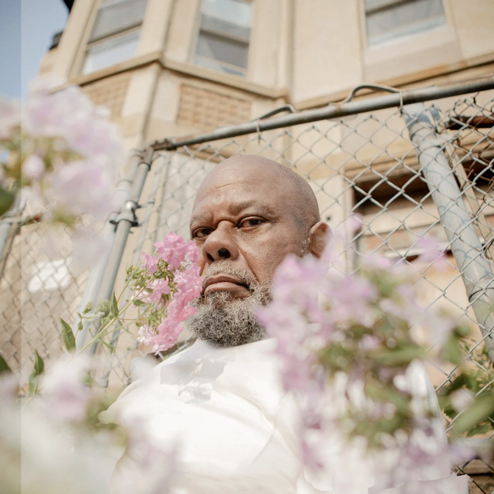

#### Comme prévu, 2022 a vu une petite accélération niveau grosses sorties en ce mois de février, avec des retours attendus, comme ceux de Beach House, Mitski, Black Country, New Road ou encore Animal Collective. Des confirmations pour certains, des retours en grâce imprévus pour d'autres. Voici, pour Sonne Qui Peut, le meilleur des albums sorti ce février.

<!--more-->

### Once Twice Melody - Beach House

Sortie probablement la plus attendue du mois de février, Once Twice Melody signe le retour de Beach House avec un disque fleuve d'une heure et vingt-quatre minutes. Un album qui aura eu pour particularité d'être divisé en quatre chapitres, chacun dévoilé en amont de la sortie finale. Une décision originale, mais qui aura eu pour effet de compromettre en partie la magie de la première écoute du produit finale. Quant à la musique, on est sur un Beach House toujours aussi soigné et aérien qu'à l'accoutumée, mais avec un arrière-goût de best of et de déjà entendu. Là où un 7 avait su faire davantage évoluer la formule.

https://youtu.be/G8E9RBuqWHc

### FEW GOOD THINGS - Saba

En 2018, Saba rentrait par la grande porte avec son deuxième album Care For Me. Un album brillant et touchant, centré autour du deuil difficile de l'artiste après l'assassinant de son cousin. Un disque marquant, qu'il est difficile d'écarter du coin de sa tête, au moment où FEW GOOD THINGS, le nouvel album de l'Américain, débarque enfin. Plus varié, plus enjoué et probablement encore plus travaillé que son prédécesseur, l'album impressionne une nouvelle fois par le soin apporté par son auteur. Saba prend même du muscle sur des morceaux plus bruts comme « Survivor's Guilt » et « Stop That ». Mais malgré cette capacité à passer de morceaux trap à des productions plus souples, FEW GOOD THINGS manque de compositions marquantes. Une étincelle, à l'image du tendre « Make Believe » en feat. avec Foushée, qu'on peine à retrouver tout au long du disque.

https://youtu.be/W9AU5z8d-o4

### Ants From Up There - Black Country, New Road

C'est tout juste quelques jours après la triste nouvelle du départ de son chanteur Isaac Wood que Black Country, New Road nous sert sur un plateau son deuxième album. Un goût amer vu le contexte, mais qui laisse vite place à la satisfaction d'entendre enfin la véritable éclosion du groupe anglais. Enfin, car malgré un battage médiatique considérable, For The First Time peinait à convaincre. Son successeur est donc là pour remettre les pendules à l'heure, à l'aide de compositions à rallonge terriblement intenses et prêtes à s'effondrer à tout instant. Un disque indie rock du genre bouleversant, bien aidé par l'interprétation de son (ex)-chanteur, comme sur le phénoménal « The Place Where He Inserted The Blade » dont on peine encore à se remettre. Non mais quel titre, bordel.

https://youtu.be/YPrs3DqraWM

### Time Skiffs - Animal Collective

Est-on en droit d'attendre encore quelque chose d'Animal Collective ? Après des albums plus quelconques les uns que les autres post-Merriweather Post Pavillon, on s'était fait à l'idée que la formule magique s'était définitivement barrée des années 2000 pour se réfugier chez un de ses membres, Panda Bear (Panda Bear Meets The Grim Reaper,2015). A-t-on eu tord ? En tout cas, ce nouvel album de la formation, Time Skiffs, semble nous indiquer tout n'est peut-être pas fini. Loin des éruptions foutraques des débuts, ce disque nous présente une formation loin d'être fâchée avec des structures plus classiques et quelques ancrages pop, tout en conservant ce goût pour les virages expérimentaux. Du haut de ses quasi sept minutes, « Strung with Everything » en est un bon exemple. Un des points culminants de Time Skiffs, capable de vriller à tout moment autour d'harmonies vocales irrésistibles.

https://youtu.be/ehaGlhglM5Y

### Laurel Hell - Mitski

A seulement 29 ans et six albums, Mitski apparait déjà comme une figure ultra respectée de la scène indie, une référence pour toute une génération de jeunes bedroom artistes cherchant à trouver les mots pour chanter leur désarroi de manière la plus subtile possible. Après une relation compliquée avec l'industrie musicale et des disques archi plébiscités, Mitski range à nouveau les guitares d'un « Your Best American Girl » pour affiner toujours plus son son avec ce nouvel album, Laurel Hell. Place aux synthés 80s, et à une collection d'indie pop songs raffinées. Un cocktail étonnant, entre les éruptions pailletées d'un « Love Me More » et les sorties hantées de « Valentine, Texas ». Le mouillage de nuque est parfois nécéssaire, mais le bon goût est toujours de mise.

https://youtu.be/GOeAaxvidPI

### Donda 2 - Kanye West

T'as quand même pas cru que j'allais évincer Donda 2, si ? N'y allons pas par quatre chemins, c'est un mauvais Kanye West. Jamais l'artiste n'aura sorti un album aussi peu fini, aussi grossier et peu inspiré. C'est un fait, Donda 2 est un disque embêtant. Embêtant car on aurait aimé qu'il ne soit jamais sorti. Rien que l'idée même de sortir un album intitulé Donda 2 n'est pas digne de l'artiste. Pourtant, oui car pourtant. On finit toujours par trouver quelques prods qui chatouillent, une ligne bien placée, un feat. brillant... c'est maigre, c'est une certitude. Mais par les temps qui courent, ça reste bien plus que ce que nous offrent bon nombre de ses contemporains. On lâche pas de lien, monsieur ayant boudé les plateformes.

## Et comme toujours, la playlist Sonne Qui Peut :

https://open.spotify.com/playlist/7KvmElAbF9ISe5YRkfHGlW?si=6222f958425d4eb6
