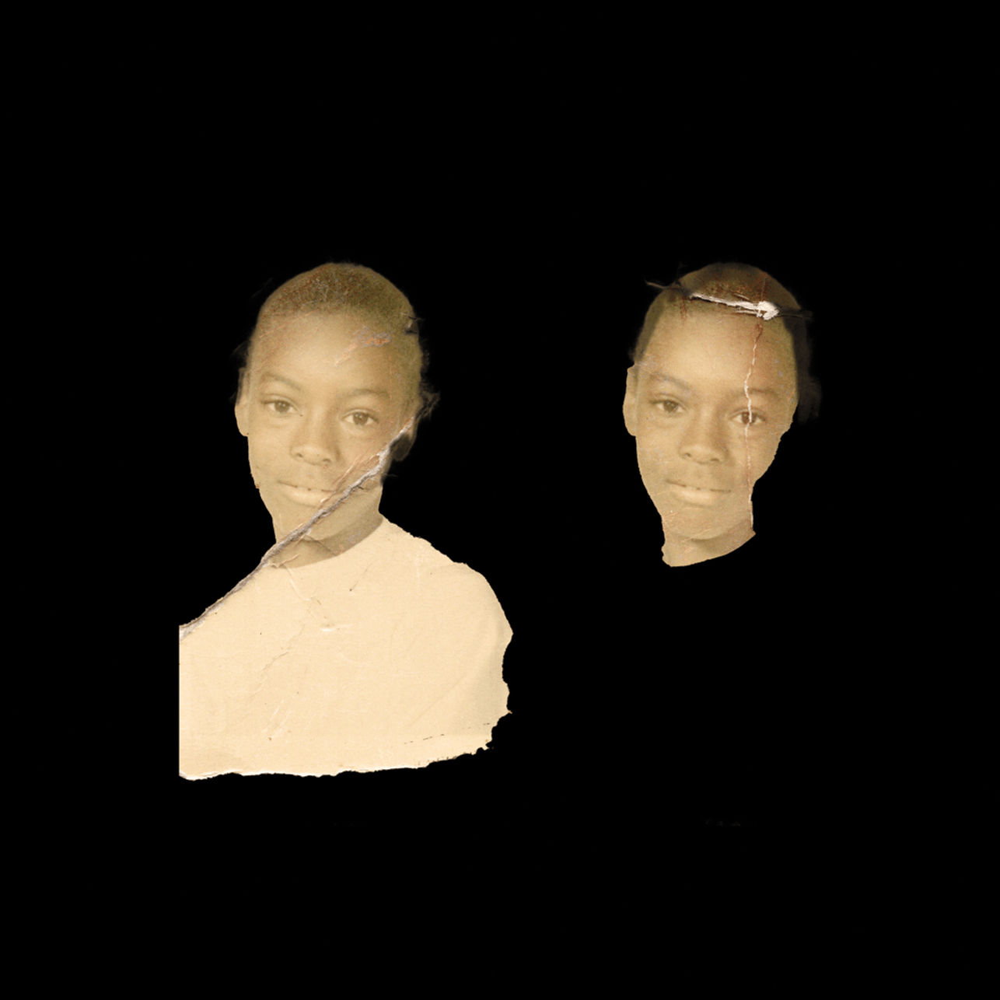
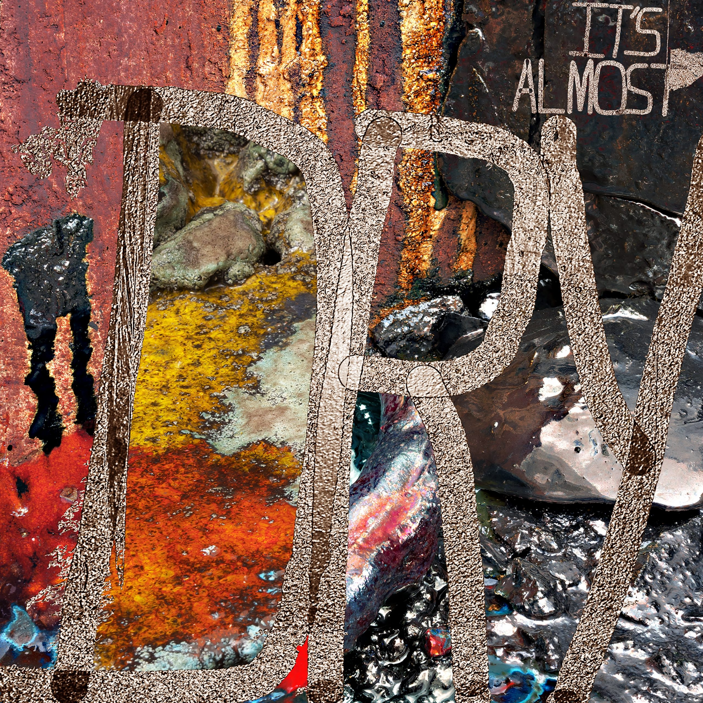
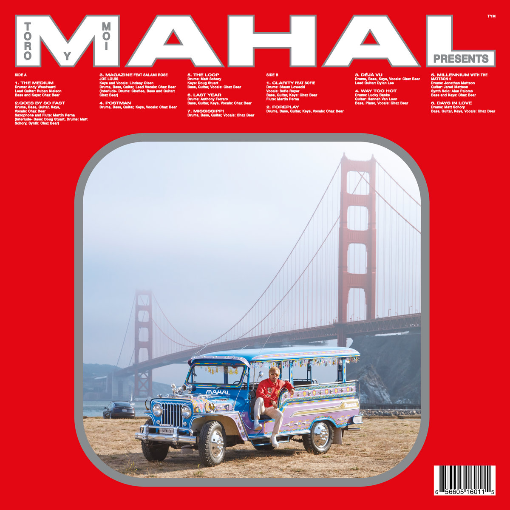

#### Ah oui, ben oui, ça s'accélère. Des tournées qui reprennent de plus belle et les beaux jours qui arrivent, accompagnés par des vendredi bien chargés. On a quand même du écrémer, en sélectionnant uniquement les coups de coeur de ce mois d'avril 2022. Ça passe par le retour en grâce de Jason Pierce et son space rock, l'increvable Pusha T ou encore les douceurs pop psyché de Toro Y Moi.

<!--more-->

### Everything Was Beautiful - Spiritualized

Issu des mêmes sessions que son prédécesseur And Nothing Hurt - et dont les deux titres s'inspirent d'une phrase de l'auteur de la contre-culture US Kurt Vonnegut, ou d'un album de Moby, si vous souhaitez casser l'ambiance - Everything Was Beautiful est un petit miracle. Peut-être être bien le véritable dernier disque de la formation de Jason Pierce, ce dernier retrouve la grandeur des grandes heures de Ladies & Gentlemen ou Lazer Guided Melodies. Là où l'artiste peinait un peu à nous enchanter en 2018, Everything Was Beautiful y parvient à nouveau, à coup de vagues de textures, de coeurs gospel, et surtout de grandes mélodies tragiques qui nous font vaciller de notre fauteuil. On aurait difficilement pu espérer mieux pour terminer l'histoire en beauté.

https://youtu.be/6EsC1-mQazw

### Emotional Eternal - Melody's Echo Chamber

On avait un peu perdu de vue Melody Prochet, suite à des mésaventures de santé, forçant la chanteuse à se mettre en retrait. Bon Voyage était-il un dense au revoir ? Et bien non. Melody's Echo Chamber laisse de côté toutes ces années perdues, comme elle le chante si bien sur le dansant « Pyramids in the Clouds », et revient avec un magnifique troisième album, Emotional Eternal. Raffiné, orchestré, inspiré, ce court mais intense retour nous embarque dans un voyage de 35 minutes où se mélangent mélopées en anglais et français, traversées par des excursions tantôt synthétiques, aériennes ou groovy. Une pop psychédélique sophistiquée à laquelle nous a déjà habitué la chanteuse mais qui n'aura probablement jamais aussi bien sonné qu'avec ce nouveau disque inespéré. Vous reprendrez bien un peu de basse ?

https://youtu.be/83R6r2xILx8

### It's Almost Dry - Pusha T

Eternel planqué du rap US, Pusha T nous a laissé un agréable goût en bouche en 2018 avec son DAYTONA, court et remuant album issu d'une série de productions signées Kanye West. Un coup de boost dans la carrière de l'ex-Clipse qui lui a fait le plus grand bien, et à nous aussi. Evidemment, quand il ne se dandine pas dans le clip du single « Diet Coke », Ye est une nouvelle fois aux manettes du disque suivant, mais cette fois-ci en compagnie de Pharrell Williams. Les deux géants se divisant l'album de Push, It's Almost Dry sonne parfois comme deux albums, deux mondes différents, collés un peu artificiellement ensemble. Il n'empêche qu'entre les cartouches rebondissantes de Pharrell et les samples du Kanye, Pusha T n'a plus qu'à enfiler les chaussons et se mettre à l'aise.

https://youtu.be/HFrwm6oRYJg

### Ramona Park Broke My Heart - Vince Staples

Vince Staples nous avait presque fait douter. Celui qui avait accouché du grandiose et sombre Summertime '06 en 2015 ou du synthétique Big Fish Theory en 2017 avait-il déjà épuisé son stock de créativité ? Après des projets corrects mais sans folie comme FM! ou son dernier Vince Staples l'an dernier, la question se posait. Bien loin de terrassant « Blue Suede » issu de son premier EP, Staples revient avec Ramona Park Broke My Heart, un disque aux productions rondes où plane une certaine mélancolie sur une enfance passé au sein des Crips dans un Long Beach peu fréquentable. Proche de sa dernière sortie mais plus consistent, ce nouveau disque montre un Vince Staples excellant dans cet équilibre entre prods aériennes, flow nonchalant et groove west coast. « When Sparks Fly » de très loin le bijou de ce nouvel album.

https://youtu.be/8Un0nhTbzMk

### MAHAL - Toro Y Moi

C'est en se remettant son album live Live From Trona que je me suis dernièrement rappelé de tout le plaisir que peut procurer un Toro Y Moi, menant sa petite carrière au rythme qu'il a décidé. Sans oublier un Outer Peace, qui reste à ce jour une des meilleures sorties de l'année 2019. C'est donc avec l'attendu MAHAL, aux extraits séduisants, que revient l'Américain. Toro Y Moi, comme à l'accoutumée, fait toujours l'étalage de son sens de la mélodie et du groove à travers une série de titres oscillants entre pop bouncy et rock psyché. Dans une atmosphère globalement lente et vaporeuse, se cachent des morceaux mieux produits que jamais, sans jamais paraître trop lisses et créant une atmosphère enivrante. MAHAL nécessite en revanche plusieurs écoutes pour se laisser appréhender. Un album qui s'écoute dans son ensemble, même si on ne peut s'empêcher de repasser en boucle le fabuleux « The Loop ».

https://youtu.be/CvcoxunP7KU

### Et comme toujours, tout et plus encore à retrouver dans la playlist Spotify de Sonne Qui Peut

https://open.spotify.com/playlist/7KvmElAbF9ISe5YRkfHGlW?si=b9f86fae206c4cca
