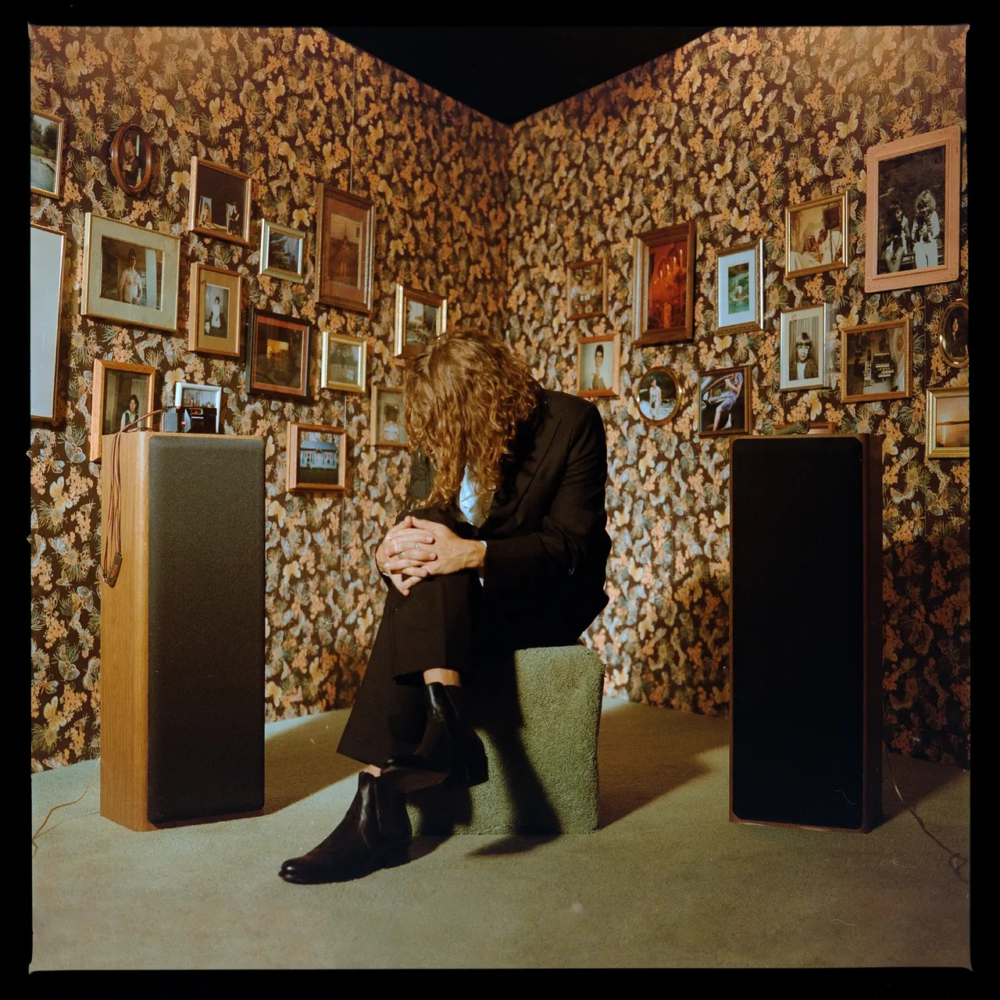

#### Trop longtemps attendu depuis la sortie de DAMN en 2017, Kendrick Lamar est finalement redescendu sur Terre en ce mois de mai. Avec un album à la Kendrick, c'est à dire plus imprévisible et riche que jamais. Sharon Van Etten et Kevin Morby n'ont quant à eux visiblement rien perdu de leur talent, et les jeunes Porridge Radio et The Stroppies passent définitivement à la vitesse supérieure avec des albums très réussis.

<!--more-->

### Mr. Morale & the Big Steppers - Kendrick Lamar

Dites au revoir à Kung Fu Kenny, place à Oklama. A travers sa nouvelle persona, Kendrick Lamar balaye son statut de demi-dieu, de grand sauveur de l'humanité, de figure infaillible. Mr. Morale & The Big Steppers, double album qui aurait dû nous parvenir bien plus tôt, est le témoignage d'un artiste confus et en proie au doute. A travers 18 titres tantôt minimalistes, tantôt dansant avec un piano omniprésent, Kendrick se livre comme jamais auparavant sur sa vie familiale, ses traumatismes, son statut d'icône et sur l'époque. Peu de titres à passer en radio pour son album le moins accessible à ce jour, mais un nouveau récital de storytelling et une richesse toujours sans équivalant. Grand disque.

https://youtu.be/toEW7\_-pvOY

### Waterslide, Diving Board, Ladder To The Sky - Porridge Radio

Après un premier album très convenu dont on avait du mal à saisir l'intérêt, c'est fait : Waterslide, Diving Board, Ladder To The Sky est bien l'album qui mettra tout le monde d'accord et justifie la hype. Dès les premiers instants, le groupe accouche d'un « Back To The Radio » que la plupart des formations indie rock du moment rêveraient de composer. Une montée en puissance sur un morceau catchy qui fait l'étalage de toute la puissance émotionnelle de la voix de Dana Margolin. Pendant tout l'album, Porridge parvient à conserver cette formule entre cadence électrique, respirations aux synthés et des harmonies aux bord du gouffre. Absolument rien à jeter, et une formation qu'on a hâte de voir défendre cet album sur scène cet été.

https://youtu.be/NDw9nTQKGd4

### Levity - The Stroppies

On vous passera l'histoire du petit groupe indé qui a enregistré son nouvel album à distance pendant le confinement tout ça tout ça pour en venir aux faits : Levity de The Stroppies doit absolument être écouté. Formation australienne à la sensibilité jangle pop, The Stroppies vient définitivement de franchir un nouveau pallier avec ce nouveau né paru chez Tough Love. Plus épais, plus intense et plus inspiré que ses prédécesseurs, Levity est un condensé de mélodies nonchalantes sur fond de rythmiques indie pop. Qu'on ait envie de sautiller sur « Up To My Elbows », de chanter le refrain de « Smilers Strange Politely » ou de mimer les notes d'accordéon du remarquable « Butchering the Punchline », Levity ne laisse définitivement pas indifférent.

https://youtu.be/n5p7js6ExiI

### We’ve Been Going About This All Wrong - Sharon Van Etten

C'est peu de temps après Primavera Sound Barcelone et une prestation habitée et tout en maitrise au coucher du soleil que l'on écrit ces lignes. Sharon Van Etten, un nom qui résonne de part sa prestance, une discographie plus qu'aboutie et surtout une voix, puissante et frissonnante. Après un remarquable Remind Me Tomorrow en 2019, la grande prêtresse de la pop song larmoyante revient avec We’ve Been Going About This All Wrong. Un album plus introspectif que jamais et bourré de remises en question à la suite de ces années à subir les événements récents. Sans renouveler sa formule, l'album déroule son lot d'envolées dramatiques finement orchestrées, et surtout magnifiquement portées par les mélodies vocales aériennes de cette voix qui semble si parfaite. En fin de tracklist, on appréciera également la sortie de route acoustique d'un « Darkish » et le rythme entrainant du tubesque « Mistakes ».

https://youtu.be/Bwh9Z98lF\_E

### This Is a Photograph - Kevin Morby

Après un Sundowner en dedans, on s'était dit, ça y est, la meilleure version de Kevin Morby est bien derrière nous, c'est parti pour un enchaînement de disques plus ou moins quelconques qui vont se fondre dans le marasme du flux de sorties hebdo. Erreur. Si on garde en souvenir le spirituel et très subtil Oh My God, This Is A Photograph nous renvoie à un plaisir d'écoute qu'on ne pensait ne plus retrouver chez l'Américain. Comme un vieux briscard du rock, Morby nous emmène dans l'Amérique profonde, à la recherche de l'anthem folk-rock parfait (« A Random Act of Kindness »), de la ballade baroque mélancolique qui prend aux tripes (« Five Easy Pieces ») ou du classique rock et sa guitare fuzzy taillée pour enflammer la scène (« Rock Bottom »). Le songwriter se livre, derrière quelques photographies d'un souvenir lointain, et partage ici un condensé percutant de ce qu'il sait faire de mieux musicalement.

https://youtu.be/HN82J9RvCMY

### Et comme toujours, tout et plus encore à retrouver dans la playlist Spotify de Sonne Qui Peut

https://open.spotify.com/playlist/7KvmElAbF9ISe5YRkfHGlW?si=35e94d4aec054582
