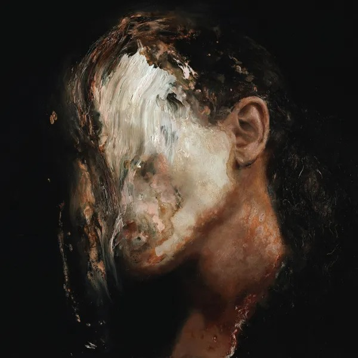
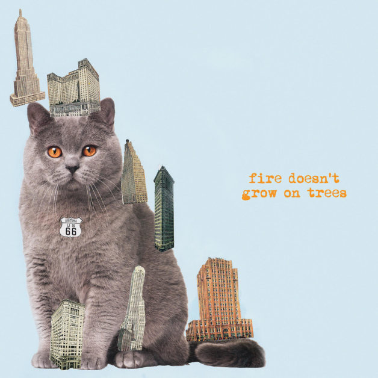
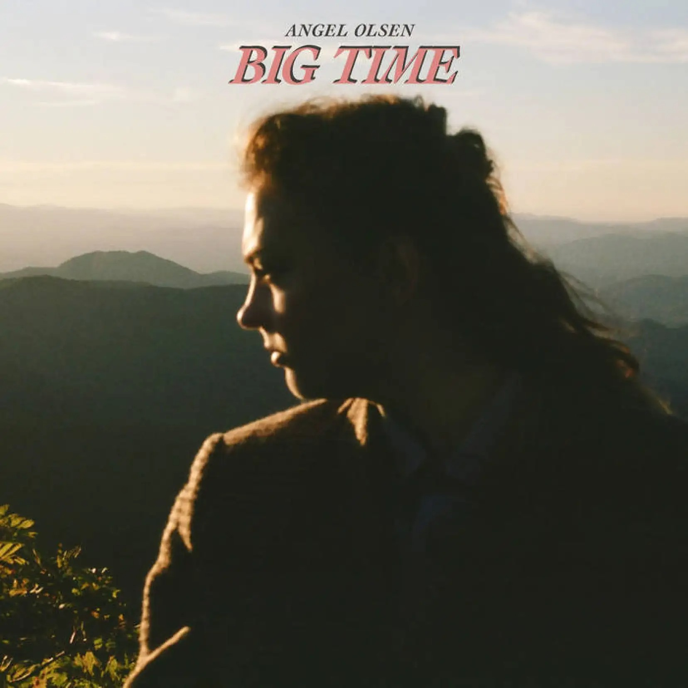
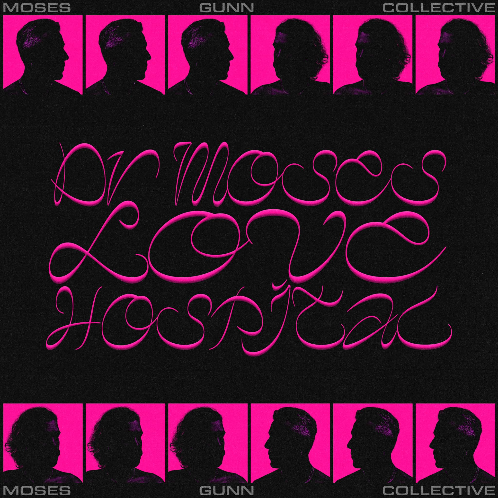

#### D'accord c'est l'été, mais on va quand même pas évacuer tous les albums tristes ? S'agirait quand même pas de passer à côté du retour de la grande Angel Olsen, qui sans l'ombre d'un doute renforce plus que jamais son statut d'artiste archi accomplie avec un Big Time folk-country convainquant. Anton Newcombe parvient enfin à raviver un peu la flamme du Brian Jonestown Massacre, tandis que la brillante 070 Shake vient probablement de sortir un deuxième album surpassant son déjà formidable Modus Vivendi. Deux autres noms, probablement moins établis, mais dont il est plus que jamais temps de découvrir avec la trap de Cochise et le collectif Australien pop psyché Moses Gunn Collective.

<!--more-->

### Fire Doesn't Grow On Trees - The Brian Jonestown Massacre

Vous vous souvenez du Brian Jonestown Massacre ? Ou de Anton Newcombe ? Mais si, pour les plus jeunes, c'est le vieux monsieur aux cheveux longs qui poste ses photos de salades faites maison et ses trajets en Uber sur Twitter. Quand il ne s'adonne pas à du contenu creepy en filmant tout ce qui bouge, Newcombe fait de la musique. On l'oublierait. La dernière fois qu'on en prenait encore conscience, c'était en 2018 sur le bien beau Don't Get Lost. Et le revoilà, qui retrouve enfin la formule pour gratouiller quelques accords percutants sur Fire Doesn't Grow On Trees, déjà le dix-neuvième album de la formation. Rien de nouveau sous le soleil (californien), mais une belle collection de sorties de route hypnotiques qui donnent quelques sueurs.

https://youtu.be/zdyFPXLJ7CY

### You Can't Kill Me - 070 Shake

Certains artistes, pourtant émergents, donnent parfois l'impression que le chemin est tout tracé et qu'aucune fausse note ne peut nous tomber dessus. C'est dans cette catégorie-là que rentre 070 Shake, depuis son grandiose premier album Modus Vivendi en 2020. Témoignage frappant de l'éclosion d'une artiste multifacettes, le disque est désormais suivi par son très attendu successeur, You Can't Kill Me, allant encore plus loin dans les explorations sonores synth-pop, hip-hop, r&b derrière ses harmonies si reconnaissables. Un nouveau-né plus maitrisé et raffiné que Modus Vivendi, plus spatial que jamais grâce à la touche Mike Dean, probablement moins _in your face_, mais qui gagne en complexité et apparaît probablement comme sa meilleure sortie à ce jour.

https://youtu.be/qEfYSU689mw

### Big Time - Angel Olsen

Ah Angel. Madame. Quelle douce évocation que le nom de la chanteuse américaine. Depuis son All Mirrors en 2019, oeuvre épique pleine de souffrance tutoyant le sublime grâce à ses orchestrations d'un autre monde et ses déflagrations vocales d'une beauté sans nom. L'artiste se sera même permis le luxe de sortir l'année suivante une nouvelle version retravaillée et épurée presque du même niveau. C'est désormais avec Big Time que Angel Olsen pavane fièrement. Un album bien moins grandiloquent, dont la force tranquille repose sur ses sonorités country-folk, mais pourtant empreint de la même gravité. On y trouve même deux de ses plus beaux titres, « Right Now » et « Go Home ».

https://youtu.be/N9oA2fshdAs

### THE INSPECTION - Cochise

Fin 2021, je vantais les mérites de la nouvelle bestiole de Playboi Carti, en avançait que ses héritiers se réclameraient sous peu de Whole Lotta Red. Nous y sommes, Cochise fait partie de cette génération. Localisé dans la planète rap après un premier album remuant Benbow Crescent, l'Américain remet ça avec THE INSPECTION. Disque grosse production signé chez Columbia, Cochise sort l'artillerie lourde avec des guests qui pèsent comme Chief Keef et Young Nudy, un flow joueur qui glisse en répétant phrase sur phrase sur des prods synthétiques enfumées qui font penser à du Lil Uzi Vert. Vous l'aurez compris, Cochise est désormais à placer entre ceux deux-là dans cette scène trap/mumble rap/cloud rap/whatever.

https://youtu.be/Hg3pdSzbW5Y

### Dr Moses Loves Hospital - Moses Gunn Collective

Tiens, voilà un groupe australien. Ou plutôt un « collectif » qui, on l'apprend, compterait plusieurs membres passés par The Belligerents. Déjà un bon point pour Moses Gunn Collective, ce collectif donc, qui signe aujourd'hui un nouvel album intitulé Dr Moses Loves Hospital. Et à son écoute, on se demande bien comment on a bien pu passer à côté. Après une ouverture fort séduisante disco-pop (« Dr Moses »), le disque enchaîne sans prévenir les tubes shiny. Ça chante en choeur, les refrains percutent, et ça sent bon la production rétro derrière quelques effluves psychédéliques (évidemment, c'est australien !). Le reste de l'album joue à fond la carte du synthé flashy et des rythmes parés pour les nuit agitées. On est sur un cocktail assez savoureux, le tout sur une petite bombe tassée sur 36 minutes.

https://youtu.be/85wI-gQHUd0

### Et comme toujours, tout et plus encore à retrouver dans la playlist Spotify de Sonne Qui Peut

https://open.spotify.com/playlist/7KvmElAbF9ISe5YRkfHGlW?si=129a7e39888c4d44
