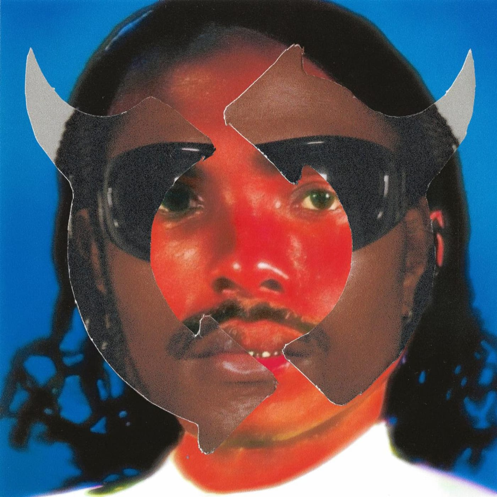
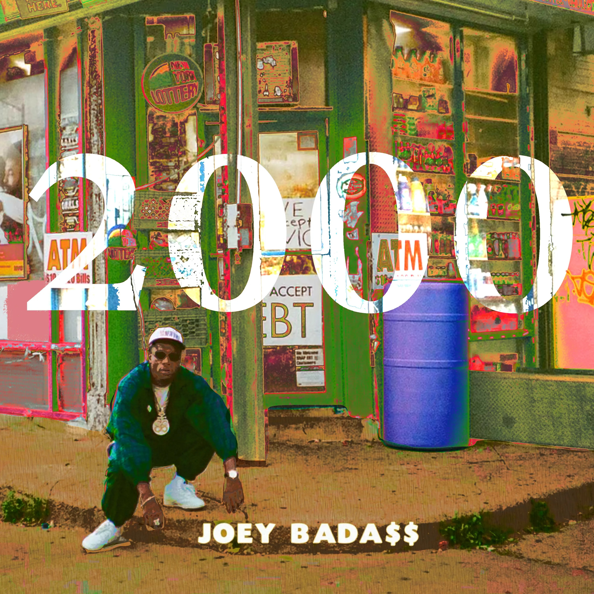
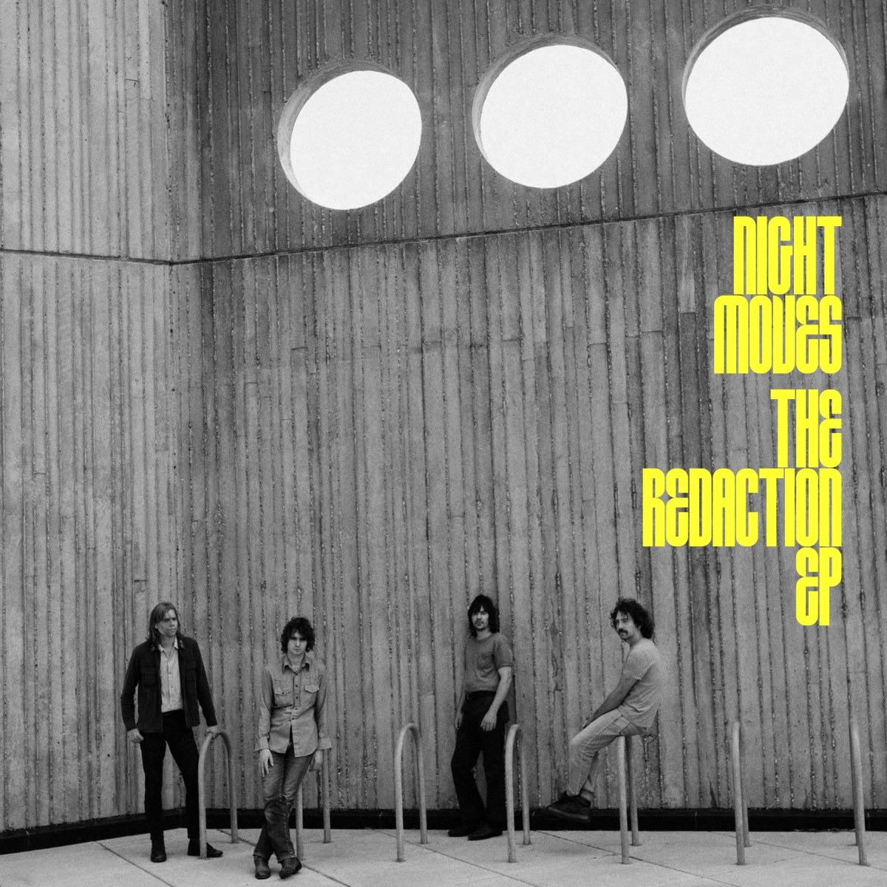

#### On va pas se mentir, du côté de Sonne Qui Peut, juillet 2022 sera R&B, hip hop et dansant ou ne sera pas. Entre la locomotive Beyoncé clairement pas venue pour roupiller, Joey Bada$$ et ses prods old school entêtantes ou le groovy nouvel album de Steve Lacy, on ne reprochera pas à tout ce beau monde d'avoir attendu les beaux jours pour nous ambiancer.

<!--more-->

### RENAISSANCE - Beyoncé

Qu'on soit fan, qu'on ne le soit pas, ou qu'on soit totalement indifférent, la sortie d'un nouveau Beyoncé est toujours un événement dans une année musicale. Accompagné d'une pochette au style particulier dont seule l'artiste a le secret et d'une liste de crédits impressionnante, Renaissance est un nouveau terrain de jeu pour Beyoncé. Cette dernière, à l'image du single « BREAK MY SOUL », s'ouvre des portes house pour un album conçu comme un joyeux exutoire. Résolument dansant, le disque n'en oubli pas des apartés pop, trap ou même funk. Sans pour autant être plus diversifié que Lemonade, l'album offre un nouveau versant réussi à la carrière de Beyoncé. En attendant les chapitres suivants ?

https://youtu.be/aD3HgrfjrAw

### Gemini Rights - Steve Lacy

Celui qu'on a bien trop vu chez les autres et pas assez chez lui nous gratifie enfin du successeur de Apollo XXI sorti en 2019. Gemini Rights, nouveau format court d'un peu plus d'une trentaine de minutes, remplit toutes ses promesses : un disque qui chante l'amour du début à la fin sur des compositions R&B/funk toutes plus belles les unes que les autres. Si l'album met plus de temps que son prédécesseur à être appréhendé, c'est en retour plus de cohérence et une oeuvre plus aboutie qu'il offre en retour. Lacy déroule son style si reconnaissable avec ses habituels accords de guitare et ses sublimes harmonies vocales, tout en réussissant à offrir suffisamment de diversité, entre la bossa nova de « Mercury », l'hallucination frankoceanesque « Cody Freestyle » ou le tubesque « Bad Habit ».

https://youtu.be/U5kT8ECYOBs

### 2000 - Joey Bada$$

Un album full old school, revenant sur les ruines de sa mixtape culte 1999 ? L'initiative est casse gueule. Et pourtant. Repoussé dans un premier temps à cause d'un sample bloquant la sortie, le tant attendu nouvel album de Joey Bada$$ nous rappelle pourquoi on a tant apprécié le rappeur par le passé. Exit ici les radio friendly « TEMPTATION » ou « DEVASTATED » de ALL-AMERIKKKAN BADA$$, mais du rap dur sur des prods à l'ancienne. Et malgré ses 52 minutes, les morceaux sont suffisamment variés et ne tombent pas dans le boom bap sans saveur dont d'autres s'en sont fait la spécialité. On appréciera également le sample surprenant de Men I Trust qui s'est glissé sur le titre « Show Me ».

https://youtu.be/Fy3070QgHV0

### A Colour Undone - Tasman Keith

Qui es-tu, Tasman Keith ? A vrai dire, on en a aucune idée. Mais ça, c'était jusqu'à maintenant. Le rappeur australien va très vite se faire un nom, alors que vient de sortir son tout premier album, A Colour Undone. Un projet très personnel dans son propos et qui fait très rapidement l'étalage à la fois du talent de Keith mais aussi de son large champ d'action. Capable aussi bien de bangers industriels (« WATCH YUR STEP ») de lettre d'amour dansante sous autotune (« LOVE TOO SOON ») ou de morceaux ouvertement pop (« HEAVEN WITH U »), on y retrouve du Kendrick Lamar, du Brockhampton ou du Vince Staples. Pas les plus mauvaises des références, donc, pour un album que beaucoup d'artistes confirmés seraient incapables de produire.

https://youtu.be/nGdDfvSs4Xg

### Slingshot - JayWood

Élevé dans sa province canadienne de Manitoba, JayWood a eu le temps de rembobiner sur sa vie passé et ses origines, d'autant plus depuis la perte de sa mère en 2019. En résulte un album unique signé sur Captured Tracks, Slingshot, créé avec un désir d'introspection et d'aller de l'avant. Tantôt marqué par le deuil ou des événements tragiques (« Shine » écrit le soir de la mort de Georges Floyd), les titres n'en restent pas moins très colorés, mêlant majoritairement funk, R&B planant, pop et hip hop, avec comme point culminant un « God Is A Reptile » que n'aurait pas renié un Yves Tumor. Slingshot, reprenant des éléments de ses précédentes sorties, s'offre même le luxe d'une narration s'étalent sur une journée, où chaque morceau, conçu comme une nouvelle scène d'un film, pousse l'histoire un peu plus loin avec le sens du détail.

https://youtu.be/BCQiAozfK0E

### The Redaction (EP) - Night Moves

Il existe des groupes capables de quelques éclats de génie, de fulgurances électriques venues de nulle part, tout en restant dans un anonymat relatif. C'est le cas de la formation de Minneapolis, Night Moves. Le quatuor, pourtant signé chez Domino Records depuis de nombreuses années, n'en demeure pas moins peu (re)connue de par chez nous, et continue de vadrouiller sur le continent américain, comptant déjà trois albums à son actif, dont le très réussi Pennied Days sorti en 2016. Alors qu'on aurait aimé voir débarquer un album, c'est plutôt un EP intitulé The Redaction que Night Moves a décidé de sortir. Un indispensable malgré tout, sur lequel on retrouve le groupe à son meilleur à travers des compositions mêlant classic rock et psychédélisme, avec toujours ce sens aigu pour la mélodie, en atteste les remarquables « Fallacy Actually » et « Vulnerable Hours ».

https://youtu.be/VXLdTrQXzX4

### Et comme toujours, tout et plus encore à retrouver dans la playlist Spotify de Sonne Qui Peut

https://open.spotify.com/playlist/7KvmElAbF9ISe5YRkfHGlW?si=29171fcc8ccb420a
