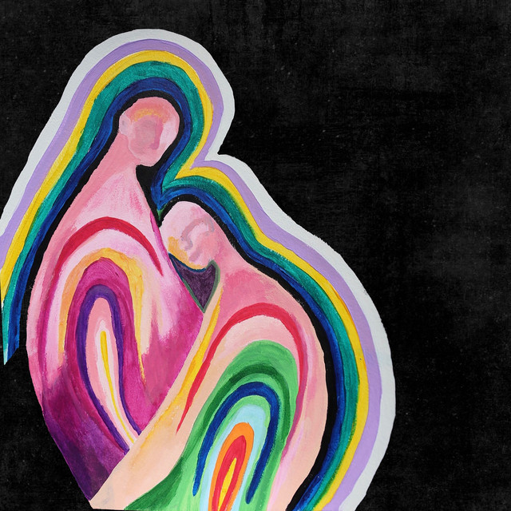
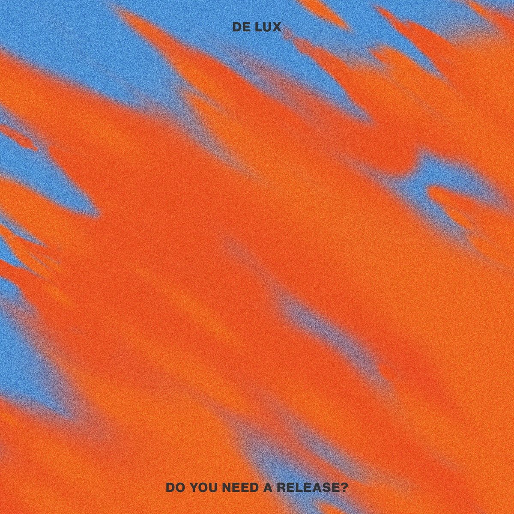

#### Si le mois de septembre est supposé assurer une reprise plus soutenue des sorties d'albums, ce cru 2022 aura été assez discret. Tout du moins du côté des grosses sorties. Seul notre Biolay national aura su répondre présent. On aurait également pu mettre en avant le retour réussi de ces chers Yeah Yeah Yeahs, mais place aux jeunes pouces qui auront su maintenir à flot le rythme des sorties qualitatives presque à elles seules. Je parle ici de l'indie pop de Sure Sure, des rythmes 80s de De Lux ou bien des expérimentations de Vanessa Amara.

<!--more-->

### Saint-Clair - Benjamin Biolay

A quoi allait ressembler le successeur du très plébiscité Grand Prix ? Retour très attendu de Biolay, qui termina sa course en album de l'année aux Victoire de la musique 2021. Et bien comme une sorte de Grand Prix 2.0, sans pour autant être issu des mêmes sessions. Pas de révolution, donc. Mais un album fleuve, ou le chanteur excelle une nouvelle fois, entre sublimes ballades nostalgiques (« Pourtant ») et hymnes strokesiens (« Les joues roses », « Forever »), le tout dans un style d'écriture toujours aussi imagé et cru. Attention à l'obsession pour les New-Yorkais, toutefois.

https://youtu.be/irJFnY5p\_EU

### Unfold - Melody's Echo Chamber

Elle aurait pu s'arrêter là, sur ces mélopées pop psychédéliques d'une autre planète qui ont illuminé nos sorties du mois d'avril. Mais 2022 est définitivement l'année de la renaissance pour Melody's Echo Chamber. Outre ce formidable Emotional Eternal, la chanteuse revient près d'une décennie en arrière pour nous gratifier cette fois-ci d'anciens inédits qui auraient dû composer son deuxième album. Unfold sonne donc logiquement différemment de son dernier né. Enregistré en compagnie de son ex de l'époque Kevin Parker, les morceaux, plus bruts, semblent échapper de sessions période Innerspeaker de Tame Impala. Un versant d'une Mélodie Prochet d'une autre époque, qu'on savoure d'avoir enfin le droit d'écouter.

https://youtu.be/9dMl6PtuikI

### Spirit Mission - Sure Sure

Parler d'indie pop de Los Angeles revient désormais à découvrir une fourmilière cachée dans un recoin de son appartement (appartement qui s'appellerait Bandcamp). La profusion est totale, et les Californiens de Sure Sure font partie des ces formations qui ont su prendre des raccourcis depuis 2014. Après plus de 150 dates et des dizaines de millions de streams grattés sur les plateformes, le trio revient avec Spirit Mission. Un album teasé depuis au moins deux ans, qui débarque enfin en ce mois de septembre avec son lot de morceaux aux refrains catchy de moins de trois minutes et de riffs de guitares glossés. Quelque part entre les escapades pop de Alt-j et Phoenix, le groupe tombe parfois dans le gentillet, mais parvient malgré tout à sortir du lot grâce des titres qui sortent de la mêlée (« California High », « 123 », « Funky Galileo ») et une production soignée.

https://youtu.be/C7hmcOo5cXA

### Do You Need A Release? - De Lux

De Lux, à ne pas confondre avec Son Lux, nous vient également de Los Angeles depuis le mitant des années 2010. Mais à la différence de nos prédécesseurs, la cadence est ici plus rapide, les rythmes sont bien plus dansants et les influences sont davantage à trouver du côté des années 1980. Avec un album sous forme de question qui amène une réponse forcément positive, le duo prend le parti de nous emmener sur le dancefloor jusqu'à pas d'heure, entre disco et new wave. Des influences que l'on peut retrouver chez Cuty Copy ou Hot Chip aujourd'hui. Do You Need A Release? est un formidable condensé sans coup de mou de dance songs synthétiques (« Validation », « All This Time »), de respirations au piano (« Morning Misses Me », « The Final Breath You Take ») et de percées synth-funk qu'on croiraient produites par Parcels (« Act of Defiance »). Grand disque, tout simplement.

https://youtu.be/whFr7M11mtQ

### Fonetica Amara - Vanessa Amara

C'est aussi à ça que servent les trouvailles du web : mettre la main sur des propositions qui sortent des sentiers battus. Tant au niveau des orientations musicales que de l'origine des artistes qui en sont les auteurs. Ici, un duo danois, dont je ne soupçonnais pas l'existence il y a à peine un mois, démontre tout son talent sur des expérimentations à base de samples hachés, de plages ambient et d'orgue en ligne directrice. Le résultat ? Un projet inqualifiable. Une pieuvre dont on peine à distinguer les extrémités mais qui, d'une manière qu'on ne saurait expliquer, s'enroule fermement autour de nous. Fonetica Amara a quelques chose de fondamentalement étrange, cryptique, mais ses voix torturées, vivantes, et ses explorations hyper-ambient-pop de moins de deux minutes s'agencent comme par magie pour nous exploser en plein coeur.

https://youtu.be/hHh1tG-vWrw

### Et comme toujours, tout et plus encore à retrouver dans la playlist Spotify de Sonne Qui Peut

https://open.spotify.com/playlist/7KvmElAbF9ISe5YRkfHGlW?si=a2e838bf973f462d
