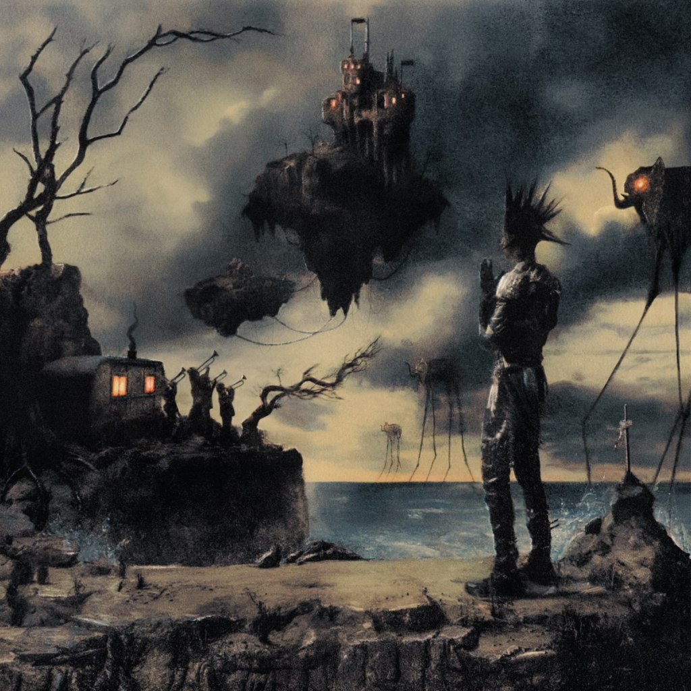
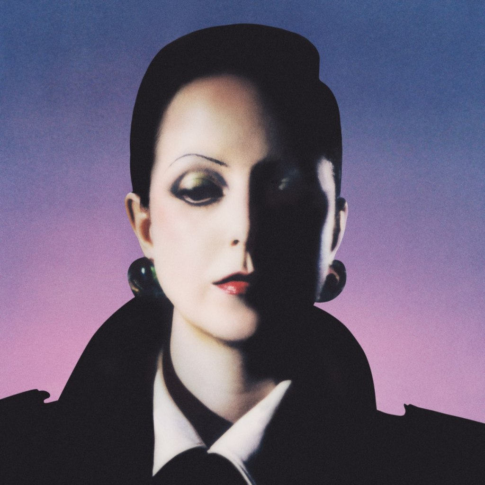
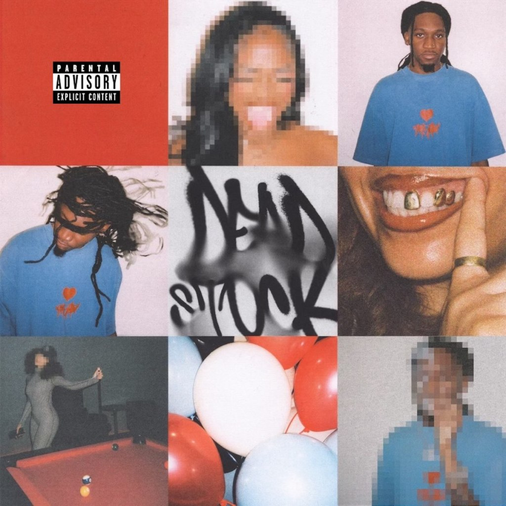
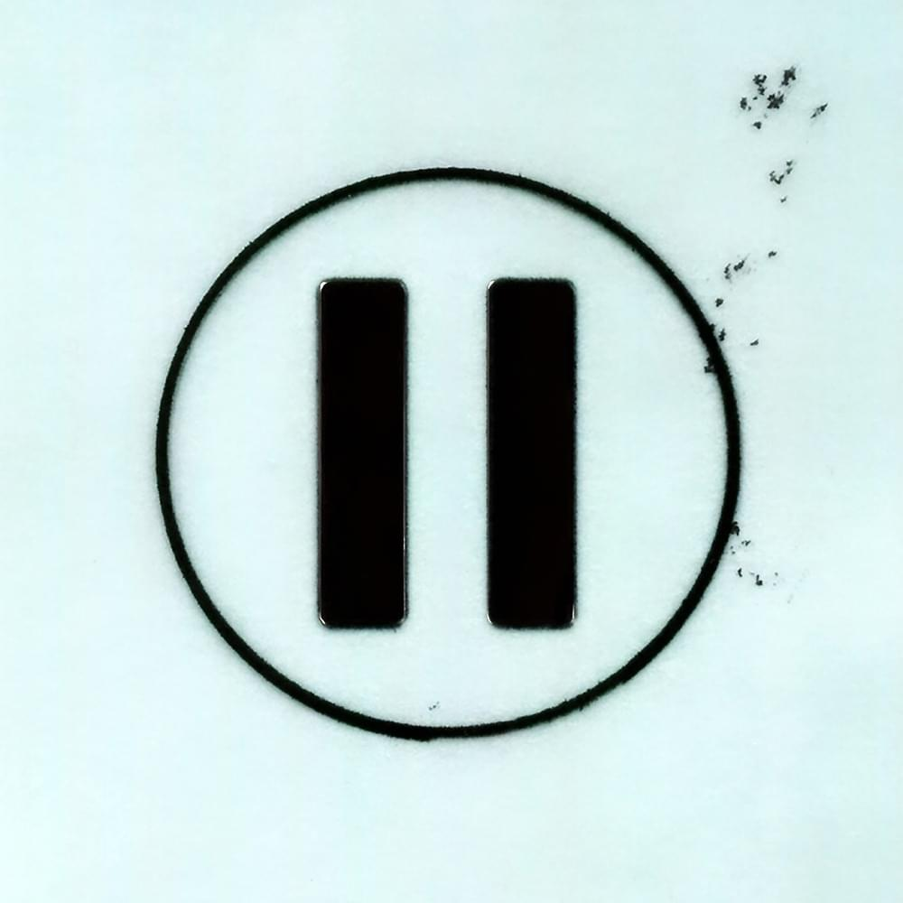
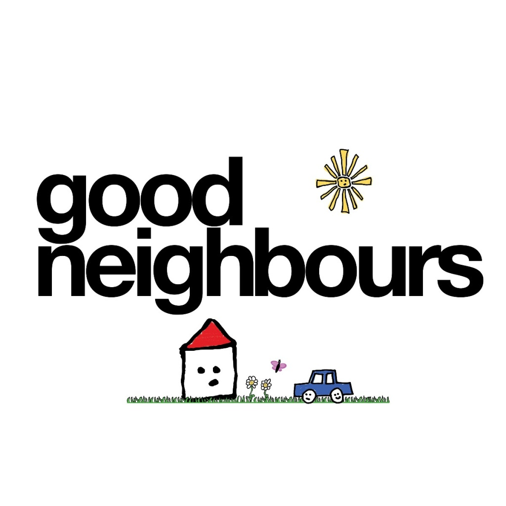
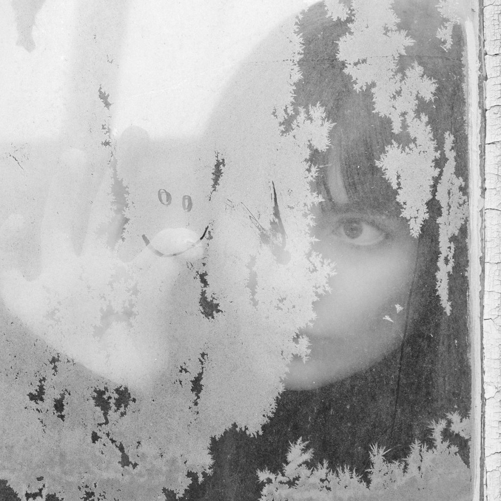
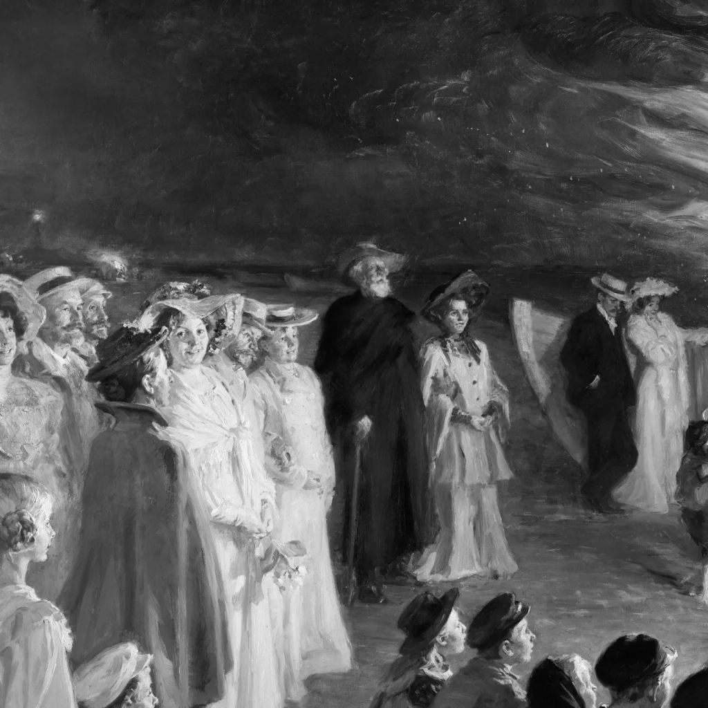
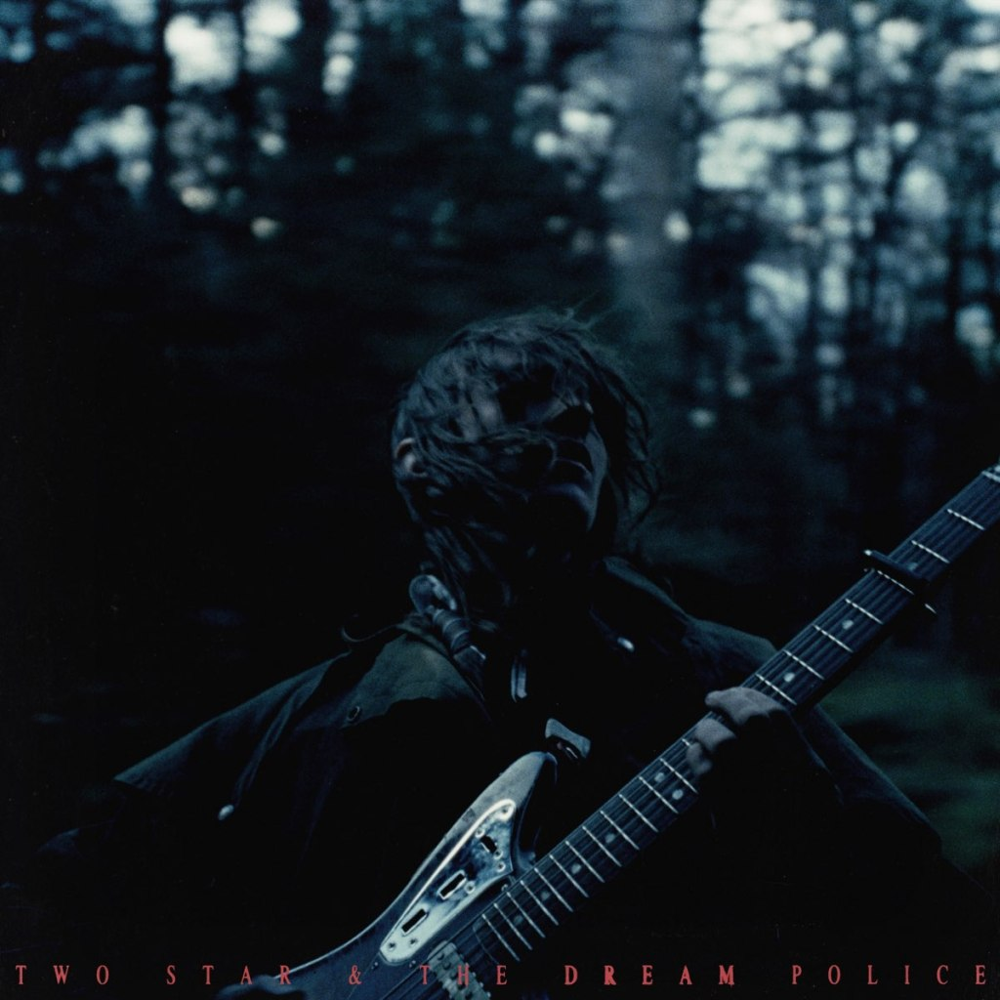
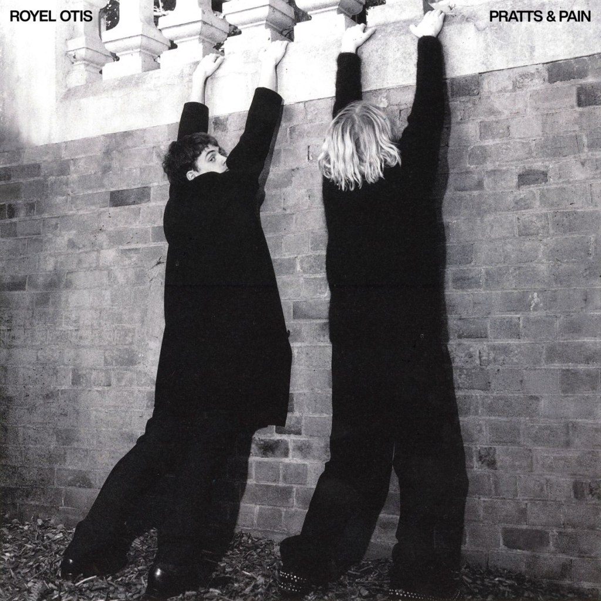
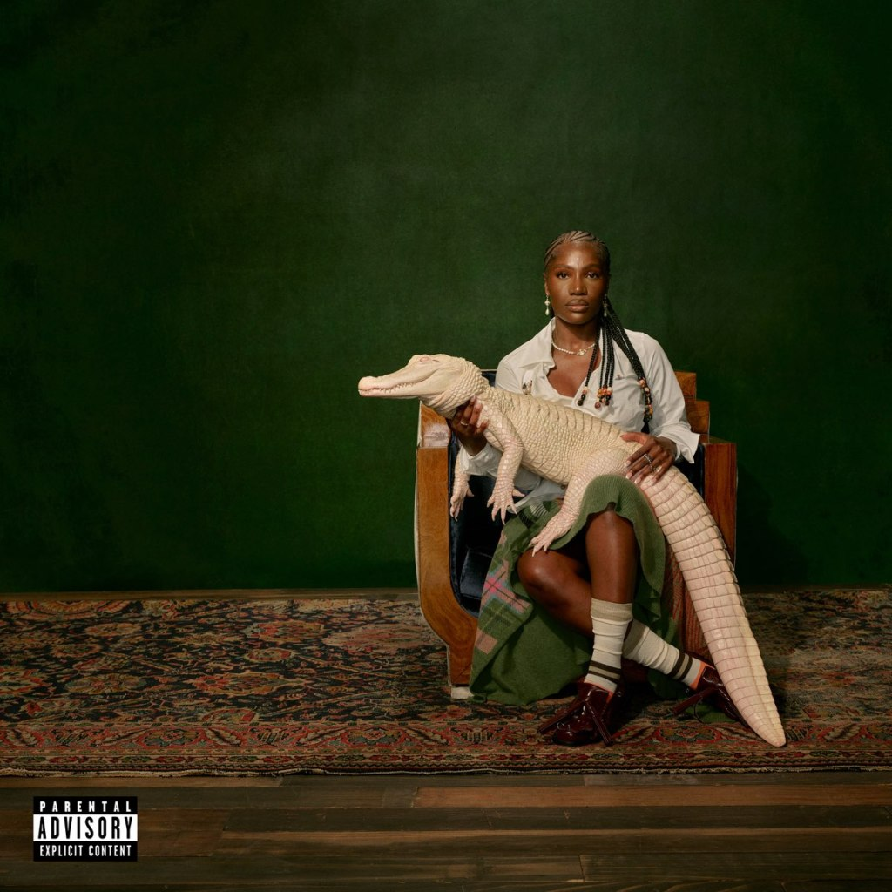

#### Avant de balancer comme des malpropres notre top final des albums de l'année, on inaugure cette année une entrée. Notre catégorie révélation de l'année à nous, histoire de remettre un coup de projo sur les noms qui ont su marquer 2024 de leur empreinte, et qui ont selon moi les moyens de marquer les années à venir.

<!--more-->

# Slimka

"_J'aurais déjà percé si j'étais Français / Mais c'est difficile d'admettre qu'un petit Suisse / Puisse être beaucoup plus fort que vous le pensiez_ », rappe Slimka sur J'avance. Difficile de donner tord au rappeur, depuis son nouvel album Le Grand Mystico en février dernier, et en observant l'état de mort cérébrale du rap français en 2024. Le constat est simple, bien que pas nouveau dans le circuit, SLI fout un peu de bordel dans une scène francophone ronronnante et ça fait du bien.

https://www.youtube.com/watch?v=0\_1QKxbh3yY

# Fabiana Palladino

Il aura fallu près de treize ans de carrière avant de voir atterrir le premier album de Fabiana Palladino. Presque un miracle pour la perfectionniste qui aura accompagné comme musicienne Sampha, Jessie Ware ou encore Jai Paul, qui l'a signé sur son label Paul Institute. L'attente en valait la peine, tant ces dix titres, oscillant entre pop, R&B et funk aux influences 80s, sont d'une beauté désarmante. Et cette voix, franchement.

https://youtu.be/jUTsFVxCxgQ?si=R25vnphf6nWctm9I

# Devin Malik

Producteur tournant autour de la nébuleuse TDE, beatmaker pour Schoolboy Q ou Isaiah Rashad, validé par Kendrick Lamar, quelle case reste à cocher pour le rappeur west coast Devin Malik ? Après des années à squatter les studios pour se faire un nom auprès de ses idoles, c'est désormais auprès du public que cherche à se faire connaître Malik. Son premier album DEADSTOCK est une démonstration de force et s'impose très facilement comme l'une des meilleures sorties rap US.

https://www.youtube.com/watch?v=OaANqrDnV3c

# The Hellp

Est-ce qu'il nous manquait pas un bon groupe sur lequel se casser des canettes sur le crâne sans réfléchir au lendemain, là ? The Hellp vient définitivement occuper une place à prendre dans le paysage actuel. Sorte de mash-up sur pattes aux contours qui débordent, le duo Noah Dillon et Chandler Ransom Lucy a bouffé les années 2000 pour mieux nous les vomir à la tronche, à coup d'hymnes hyper pop et electroclash.

https://www.youtube.com/watch?v=0iJtRBlJmuo

# Good Neighbours

Good Neighbours ne compte qu'un seul EP à l'heure où l'on se parle. Et pourtant, le duo anglais semble déjà prédestiné à fracasser les charts à coup de tube indie pop. En atteste le déjà immanquable et addictif Home, phénomène Tik Tok que Good Neighbours emmène sur les scènes du monde entier. Le reste de l'EP du même nom laisse penser que Oli Fox et Scott Verrill ont encore de quoi nous surprendre.

https://www.youtube.com/watch?v=Nkmmoq1UHIg

# Talking Flowers

Tombée sous notre radar en toute fin d'année, Talking Flowers est le genre de doux coup de coeur instantané que l'on aimerait avoir plus souvent. Astrid Brandin vient de poser avec son premier album Fabrications les premières pierres d'un univers hallucinatoire où des compositions dream pop rencontrent des arrangements 60s où tout semble s'imbriquer naturellement. Un sans faute pour la suédoise dont il faudra suivre l'éclosion.

https://www.youtube.com/watch?v=yWj\_nbWZe0M

# Chanel Beads

Le plus grand mystère réside dans la beauté de You Day Will Come de Chanel Beads. Une beauté mutante, déstructurée, dissonante, dont les cordes entrent en collision avec voix fantasmagoriques, guitares mystiques et autres éblouissements synthétiques. Ce premier album, projet expérimental de Shane Lavers, fascine de bout en bout et ne sonne comme absolument rien d'autre.

https://www.youtube.com/watch?v=oGUr9OuxTjk

# Mk.gee

En février dernier, à la sortie de Two Star & The Dream Police, l'idée de voir l'album de Michael Gordon nous exploser au visage de cette manière semblait si lointaine. Depuis, l'acolyte de Dijon à fait son parcours : TV debut chez Kimmel, tournée mondiale soldout, louanges de stars qui citent son nom à tout-va, et invité du prestigieux Saturday Night Live. Mérité, car [Mk.gee est bien l'artiste qu'il pense être.](https://sonnequipeut.com/2024/05/12/mk-gee-est-bien-artiste-quil-pense-etre/) Et ce n'est que le début.

https://www.youtube.com/watch?v=GEYiA9b6YRg

# Royel Otis

Certains nous accuserons de mentionner Royel Otis à chaque occasion qui se présente (accusations fondées, tu vas faire quoi ?). Mais 2024 aura définitivement été l'année de la consécration pour les Australiens. Un premier album réussi qui a su en quelques mois établir une fanbase dévouée à travers le monde, bien aidé par un Murder On The Dancefloor parfaitement bien senti. Le duo vient même de signer chez Capitol Records pour la suite des affaires. Du tout bon.

https://www.youtube.com/watch?v=UkDbB2rMouM

# Doechii

Que peut-il arriver d'autre à Doechii que filer à tout vitesse sur l'autoroute du succès ? Et sans péage s'il vous plait. Si l'Américaine ne débarque pas tout à fait de nulle part, sa nouvelle mixtape Alligator Bites Never Heal vient définitivement d'offrir un nouveau tournant à sa carrière, faisant étalage de ses skills et démontrant un potentiel sans limite, confirmé en live. Et quelque chose nous dit que ce n'était qu'un avant-goût de l'immensité qui nous attend sur son premier album l'année prochaine.

https://www.youtube.com/watch?v=f-OWO1aZz0g
