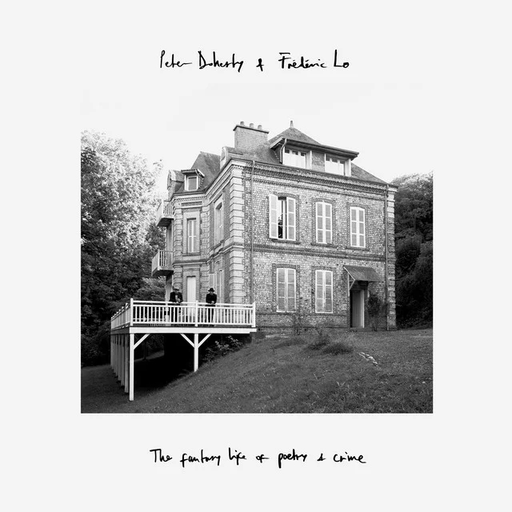
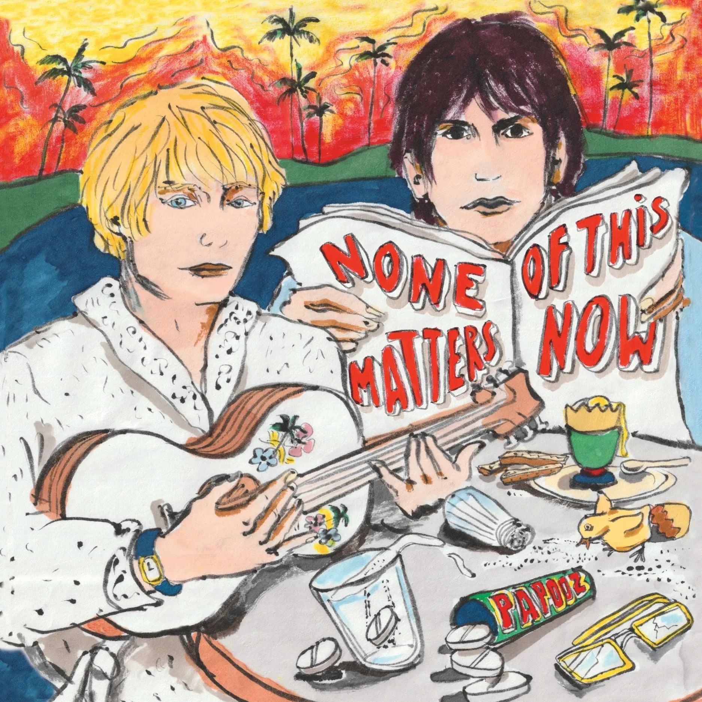

#### Incontestablement, notre mois de mars aura été marqué par le retour en fanfare inattendu de notre ami Pete Doherty, parti retrouver des couleurs en Normandie en compagnie du Français Frédéric Lo. Pour le reste, de belles surprises comme la pop audacieuse et aérienne de la Norvégienne Jenny Hval, ou encore le rock sautillant de l'Anglais Wesley Gonzalez. D'autres grosses attentes, comme les derniers Denzel Curry et Papooz, font figure de bons élèves en rendant des copies soignées.

<!--more-->

### Melt My Eyez See Your Future - Denzel Curry

Denzel Curry n'a jamais sorti de mauvais album. Dès lors, aucune raison que son nouveau né, Melt My Eyez See Your Future fasse exception. Emmené par un très ample « Walkin », l'album ouvre une nouvelle porte pour le rappeur débarqué de la flopée Soundcloud, toujours prêt à prendre un virage inattendu. Cette fois-ci, place à des prods et des voix lentes et soulful, avec un Denzel davantage tourné vers un flow old school et introspectif. Si le rendu global est plus soigné que jamais, on regrettera cependant les tirades hargneuses et l'agressivité d'un Zoo, et surtout la diversité et les bangers d'un TA13OO. Une légère frustration tant on connait le potentiel de l'intéressé, mais qui n'enlève en rien à toutes les autres qualité d'un disque qui reste très facilement dans le haut du panier.

https://youtu.be/EXoGaue8E7g

### The Fantasy Life Of Poetry And Crime - Peter Doherty et Frédéric Lo

Retiré en Normandie, après une période de désintox et un album quelconque avec les Puta Madres en 2019, on ne donnait pas cher de suite de carrière de Pete Doherty. Mais c'était sans compter sur une rencontre avec Frédéric Lo pour rallumer la lumière et permettre à l'artiste de se livrer comme jamais. Entre ballades au piano, envolées orchestrales et morceaux aux refrains entêtants, Peter Doherty n'aura jamais paru si inspiré depuis son album solo Grace/Wastelands paru en 2009. Pas rien, donc, pour l'ancien Libertines qu'on pensait condamné à survivre en enchaînant les tournées avec son groupe phare.

https://youtu.be/oFV6GhS\_zjY

### Classic Objects - Jenny Hval

L'artiste multidisciplinaire norvégienne Jenny Hval est revenue en ce mois de mars avec un nouvel album, Classic Objects. Celle qui compte plusieurs albums et romans à son actif et qui n'a pas peur de franchir les barrières des modes d'expressions artistiques livre ici un album d'une douceur et d'une efficacité remarquables. Un nouvel écrin sorti chez 4AD donnant libre cours à sa pop fraiche et expérimentale, où bruitages en tout genre cohabitent entre orgues et légères percussions. Mais surtout, on prend un malin plaisir à retrouver la voix envoutante de Hval, plus mélodique que jamais et toujours attachée à aborder des réflexions sur le soi et l'intime, avec un naturel déconcertant.

https://youtu.be/hs7\_Ow82-gk

### How Is It That I Should Look At The Stars - The Weather Station

Il y a des albums comme ça où la simple écoute se veut rassurante, où les premières notes sont annonciatrices d'un long chemin apaisant. How Is It That I Should Look At The Stars de The Weather Station est de cette trempe. Ces disques qui tombent à pic, dans ces moments où l'on a simplement besoin de quelques notes de piano et d'une voix qui nous fait comprendre qu'on est définitivement en bonne compagnie. Pas d'artifices ici, simplement un ensemble de compositions monolithiques et palpables, s'arrêtant parfois avant de reprendre de plus belle. Un minimalisme qui ne parlera pas forcément à tous les fans de Tamara Lindeman, mais qui plait fortement ici par sa beauté épurée.

https://youtu.be/PsgO4EnCf2g

### Wax Limousine - Wesley Gonzalez

On pardonnera à Wesley Gonzalez la laideur de sa pochette, tant Wax Limousine fait figure de belle surprise parmi cette liste de nouveautés. Le Londonien accouche d'un troisième album tout en démonstration de force, entre excursions funky et hymnes pop bien troussés aux influences bowiesques. Wax Limousine ne brille pas par sa subtilité, mais prend le parti de trouver sur 12 titres la formule pour faire danser et se caler dans nos playlists. Mention particulière pour les remuants « Greater Expectations » et « 1, 2, 3, 4, 5 Just Get Rid of It ».

https://youtu.be/n0Bc9kPhQjs

### None of This Matters Now - Papooz

Bercé par des hymnes rétro savoureux, on se souvient encore du goût que nous a laissés en bouche l'aventureux Night Sketches en 2019, l'apogée artistique du duo français Papooz. Comment passer après ça, donc, sans se vautrer ? Pas une mince affaire. Le groupe y parvient plutôt bien, en signant avec None of This Matters Now un retour toujours aussi feutré, mais bien plus dépouillé que son prédécesseur. Privilégiant les compositions enregistrées live tendance pop-folk lorgnant toujours autant vers les 70s, ce troisième disque n'atteint pas les hauteurs de son album concept totalement allumé, mais n'en reste pas moins une belle confirmation quant au talent qu'on ces deux là pour confectionner des mélodies solaires qui font mouche.

https://youtu.be/zBrxnOFR-p8

## Et comme toujours, tout et plus encore à retrouver dans la playlist Spotify de Sonne Qui Peut

https://open.spotify.com/playlist/7KvmElAbF9ISe5YRkfHGlW?si=a54160c6e4cc4b7a
