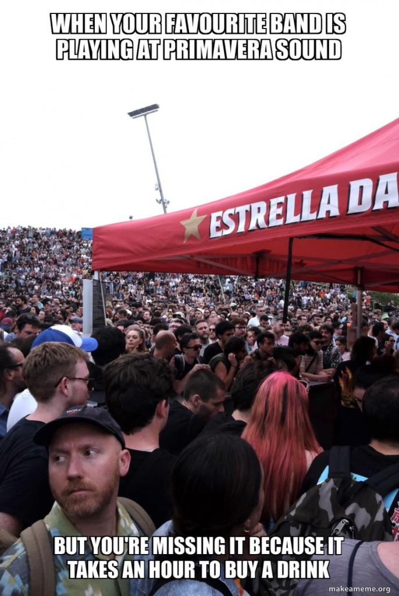

#### Ce qui devait être Primavera Sound 2020 a enfin eu lieu, en 2022. Un attente interminable pour le plus sexy des festivals européens, auquel on a eu la chance d'assister à Barcelone. Quelques couacs, mais surtout, une montagne de noms dans tous les registres qui s'enchaînent sur trois jours de folie. Vamos.

<!--more-->

200 000 billets vendus en une semaine, dès juin 2021, sur une édition dispatchée sur deux semaines et proposant pour le vingtième anniversaire du festival une programmation sans équivalant sur le vieux continent. Autant dire que l'événement était attendu, après deux années d'annulation. Et au delà, c'est aussi la promesse d'un retour des festivals en Europe dans une période bientôt estivale où le Covid semble avoir disparu sans l'être. Alors après des années de disettes et une immense attente, quel bilan faire de cette édition XXL de Primavera Sound à Barcelone ?

On avait presque oublier ce que c'était. Les énormes scènes, la foule partout, les files d'attente, les jambes en feu, les clashs d'artistes, les dépenses sans compter. Primavera coche toutes les cases. Enorme machine dont la réputation n'est plus à faire et point d'encrage de la crème de la pop mainstream mondiale et des légendes de l'indie rock anglo-saxon, le festival ambitionne de satisfaire le plus grand nombre, dans un Parc del Forum où toutes les nationalités se côtoient. Côté programmation, difficile de ne pas s'extasier devant le line-up proposé. Si on regrette de ne pas bénéficier du don d'ubiquité pour ne rien rater de cette programmation de qualité (King Krule, Beach House, The National, Charlie XCX notamment), gardons en tête les souvenirs de prestations grandioses auxquelles nous avons assisté.

https://youtu.be/bUkFrs7jAmE

Tyler, The Creator, plus que jamais déchainé, enchainant pendant une heure bien tassée une setlist imparable sur une scénographie de paysages soignés et autres effets pyrotechniques. Son live gilet jaune à We Love Green 2019 semble désormais bien loin, pour celui qui a depuis sorti deux grands albums bien présents en setlist avec IGOR et CALL ME IF YOU GET LOST. L'autre palme revient à Nick Cave et ses fameux Bad Seeds, qu'on pensait très honnêtement ne pas voir sur scène après la disparition récente de son deuxième fils Jethro. Au rendez-vous et plus que jamais habité par sa musique, l'artiste rendra d'ailleurs un sublime hommage à ses deux enfants sur le titre « I Need You ». Pendant plus d'une heure et demi, Nick Cave alternera balades et morceaux rock épiques, en allant chercher constamment le public, sans jamais oublier son sens de l'humour derrière toute cette dramaturgie. Définitivement le patron, bien aidé par des Bad Seeds et un Warren Ellis au sommet. Citons également le live mystique de Sharon Van Etten dont la voix nous fait toujours chavirer, et l'énergie des classiques de Wide Awake! entre les jams de nos chers Parquet Courts, clairement pas venu en Espagne pour bronzer. Et un gros big up (oui j'ose le big up en 2022) à Mogwai, programmé en urgence la vieille pour taper vers deux heure et demi du matin un des meilleurs live du vendredi.

https://youtu.be/obdscX0NI2U

Là où, en revanche, le bât blesse, c'est davantage côté organisation. La première déconvenue concerne la gestion des annulations. Aucune des deux têtes d'affiches annulée, Massive Attack et les Strokes, n'a été remplacée. Pire, aucune contrepartie ou aucun remboursement n'a été proposé par le festival sur une partie du pass. Quand on sait que ces noms sont les locomotives de la programmation, ça pose clairement problème. Par ailleurs, la première journée du festival s'est avérée particulièrement chaotique. Trois pauvres petits points d'eau pris d'assaut par des dizaines de milliers de personnes, des stands aux queues infernales (et eau payante bien sûr), des choix de scènes étranges pour certains artistes, une sécurité à l'entrée du festival qui ne filtre rien. En bref, une impression d'un amateurisme ambiant qui ressort d'un tel événement, comme si Primavera avait oublié depuis le vide post-2019 comment organiser dans de bonnes conditions un événement accueillant des dizaines de milliers de personnes.

Une expérience de trois jours, donc, éreintante, parfois pas aidée par une organisation qui laisse à désirer, mais une expérience forte en émotion. Nulle doute qu'on aura pris un immense plaisir à voir tous ces grands noms se succéder, et au-delà de Primavera Sound 2022, de retrouver cette forme de communion musicale à grande échelle trop longtemps absente. Va falloir songer à dormir un peu maintenant.
