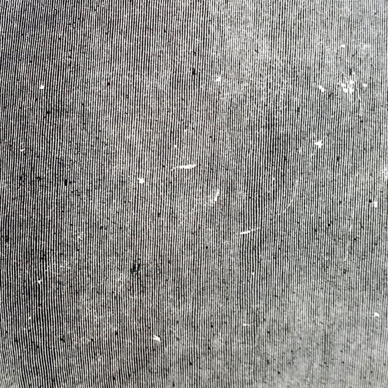

#### Entre harmonies lumineuses et déflagrations renversantes, Low livre avec HEY WHAT un treizième album aussi exigeant qu'extrême. Un retour sans véritable feuille de route, et pourtant remarquable.

<!--more-->

"_[1:29](https://www.youtube.com/watch?v=y2FQ3ih0MoE&t=89s) - [1:54](https://www.youtube.com/watch?v=y2FQ3ih0MoE&t=114s) sounds like someone trying to compress the universe into a sugar cube_ », postait il y a cinq ans un internaute dans les commentaires Youtube de "only tomorrow", titre du dernier (dernier ?) album de My Bloody Valentine, m b v. Cette petite phrase très imagée, coincée dans un coin de mon crâne depuis quelques années, symbolise de belle manière la force évocative des guitares monolithiques de Kevin Shields sur ce come back d'entre les morts. Et par ricochet, cette même petite phrase pourrait très bien apparaître en 2021, dans les commentaires Youtube de **Low**. Formation américaine montée au début des années 90 et composée de Mimi Parker et Alan Sparhawk, couple dans la vie comme en studio, Low occupe une place à part depuis presque une trentaine d'années dans ce grand fourre-tout qu'on appelle aujourd'hui l'indie rock. Trois décennies différentes durant lesquelles Low n'aura fait qu'effleurer le succès, mais qui auront permis au groupe de s'affirmer comme un nom culte aux antipodes des tendances de l'époque. Diamétralement opposé aux déferlantes grunge à ses débuts, la formation n'a, semble-t-il, toujours aucun équivalant aujourd'hui, alors que sort son treizième album, **HEY WHAT**.

Ils sont si peu nombreux, au fond, les noms à pouvoir illuminer nos petits yeux à l'annonce de leur retour. Low fait partie de cette catégorie là. Auréolé d'un succès critique implacable en 2018 avec **Double Negative**, c'est sans réelle pression que revient en 2021 le duo mormon, précédé d'une discographie presque agaçante car sans faux pas. Et alors que tout semblait à croire qu'un groupe avec une telle longévité était condamné à sortir tout au mieux de bons disques cachés par l'ombre des classiques du passé, une question improbable s'écrase sur notre route : Low vient-il de sortir son meilleur album ?

https://youtu.be/IDcMWJxQikk

Oui vous avez bien lu. C'est osé, culotté, au regard du patrimoine musical laissé par les intéressés depuis toutes ces années. Et pourtant. Dans une industrie musicale toujours plus fragilisée, où les revenus des artistes se sont effondrés et où le rythme des sorties s'est cassé la gueule en 2020, Low ne déroge pas à ses principes : tout détruire pour mieux renaître. Si Double Negative offrait déjà un aperçu des nouvelles contrées explorées par Parker et Sparhawk, HEY WHAT est l'étape ultime de cette métamorphose. Plus sombre, plus violent, plus habité que jamais, ce nouvel album entrouvre les portes d'un monde au bord du précipice où les heures sont comptées. Un sentiment d'urgence renforcé dès les premières minutes par l'outro de "White Horses" et ses pulsations oppressantes de plus en plus rapides. Si la fin est proche, si le compte à rebours précédent les derniers instants de ce monde fou furieux est enclenché, alors, ça doit se passer en musique. C'est la mission que s'est donné Low, qui, en renouvellent sa collaboration avec BJ Burton, trouve le maître artistan des grandes explorations soniques de ce nouveau disque.

Mais il ne s'agit pas ici de se contenter de compresser un maximum de sonorités et de délaisser toute forme de musicalité, car le but ultime de nos deux extraterrestres est d'atteindre un équilibre parfait entre ce jeu des textures et une forme de beauté suprême. Le Velvet Underground y est parvenu en son temps et, parmi les contemporains, les membres de The Stargazer Lilies font partie de ceux qui se rapprochent le plus de cet équilibre à travers leur shoegaze difforme. HEY WHAT y parvient. Plus d'un mois après sa sortie, l'effet est le même. Les voix du duo, plus que jamais misent en avant et véritables phares dans la nuit, sont la grande ligne directrice de cette épopée sonore. D'une beauté divine quand elles nous accompagnent dans cette lutte perpétuelle ("All Night") ou impénétrables quand elles se modulent au gré des variations instrumentales ("Days Like These"), elles sont cette bouée qui maintient notre tête hors de l'eau.

Pour le reste, c'est au rythme d'une habituelle lenteur que les vagues nous claquent les joues de toute part, à travers une multitude de vibrations, de saturations, d'expérimentations technologiques et de transitions abruptes. N'essayez même pas de comprendre les imbrications qui forment cette création, ni même de déceler où se situent les parties de guitares. Un tour de magie est un tour de magie, et il est inutile de s'entêter à vouloir comprendre le _trick_. Ultime irruption volcanique, "The Price You Pay (It Must Be Wearing Off)" (nous) termine en beauté et le sol se dérobe sous nos pieds, pris dans un tourbillon de près de cinq minutes. Le carré de sucre finit par retomber au sol dans un silence assourdissant. Et les simples mots HEY WHAT résument à eux seuls notre sentiment post-traumatique.
