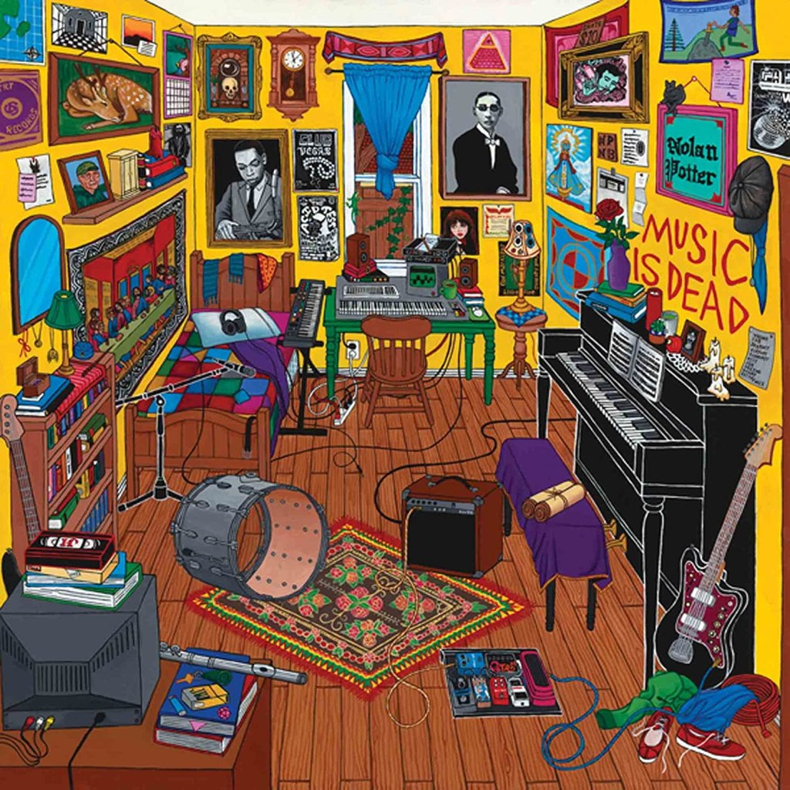

#### Entre les derniers chiffres Covid et les nouvelles sorties de nos amis candidats pour 2022, le Top 20 des albums de 2021 de Sonne Qui Peut vient égayer ton flux quotidien. Ouais, on va pas se voiler la face, on est encore sur une année assez timide, comme ce fut le cas pour 2020. Ce qui ne veut pas dire que les choix de ce top ont été faits par défaut, mais simplement que 2021 aura manqué d'un peu de folie, de grandes surprises. Pour autant, un grand merci à ces artistes hip hop, shoegaze, indie rock, pop, post punk et j'en passe pour leur contribution avec ces formidables disques. Des indispensables, pour certains beaucoup cités, pour d'autres bien trop oubliés, que tu vas devoir rattraper de toute urgence.

<!--more-->

## **1**

# Whole Lotta Red - Playboi Carti

**S'il restait encore de maigres frontières entre les genres, Playboi Carti n'en a fait qu'une bouchée. Sorti le 25 décembre 2020, Whole Lotta Red est définitivement l'album de 2021. Monolithe punk, ce dernier album du rappeur ne suit aucune tendance puisqu'il en impose de nouvelles, comme un Yeezus en son temps. Carti sème le chaos en hurlant ses tripes sur des boucles synthétiques totalement addictives. Et à l'heure où l'on écrit ces lignes, des enfants de Playboi Carti voient le jour par légion.** **C'est ce qu'on appelle un classique.**

## 2

# HEY WHAT - Low

**Aussi destructeur que lumineux, massif que harmonieux, mais surtout aussi novateur que cathartique, HEY WHAT de Low est tout ce qu'on aurait pu attendre et plus encore de cette formation unique. Inutile de [décrire à nouveau ici l'expérience procurée par cet immense disque sans équivalent](https://sonnequipeut.com/2021/10/28/si-la-fin-est-proche-sa-bo-est-signee-low/). Ce treizième album du duo est un tourbillon de sonorités, et probablement son meilleur à ce jour, après presque trente ans d'une carrière bien remplie.**

## 3

# Donda - Kanye West

**[Si l'on oublie cette édition Deluxe qui n'a rien de luxieuse](https://sonnequipeut.com/2021/12/01/donda-donda-donda-mais-pas-donda-deluxe/), Donda première version prouve une chose : non Kanye West n'est pas cramé, même en 2021. À travers un album fleuve qui rappelle les expérimentations d'un Life of Pablo, Ye ramène son bras droit Mike Dean et les stars du hip hop actuel pour livrer un disque certes un peu brouillon, mais très consistant. Si Donda n'est pas au niveau des classiques, son mélange de gospel, trap où old Kanye aura été indéniablement la bande-son de l'année et survole assez tranquillement 90% des productions hip hop US de 2021.**

## 4- Seeking New Gods - Gruff Rhys

## 5- CALL ME IF YOU GET LOST - Tyler The Creator

## 6- In Plain Sight - Neal Francis

## 7- Cookbook - John Andrews & The Yawns

## 8- Music Is Dead - Nolan Potter

## 9- CARNAGE - Nick Cave

## 10- Palais D’Argile - Feu Chatterton!

## 11- As The Love Continues - Mogwai

## 12- I Don’t Live Here Anymore - The War On Drugs

## 13- L’Etrange Histoire de Mr. Anderson - Laylow

## 14- GUMBO’! - Pink Siifu

## 15- Twin Plagues - Wednesday

## 16- Everything Tasteful - Lala &ce

## 17- Bright Green Field - Squid

## 18- Day/Night - Parcels

## 19- 9 - Pond

## 20- Don’t Go Tellin’ Your Momma - Topaz Jones

