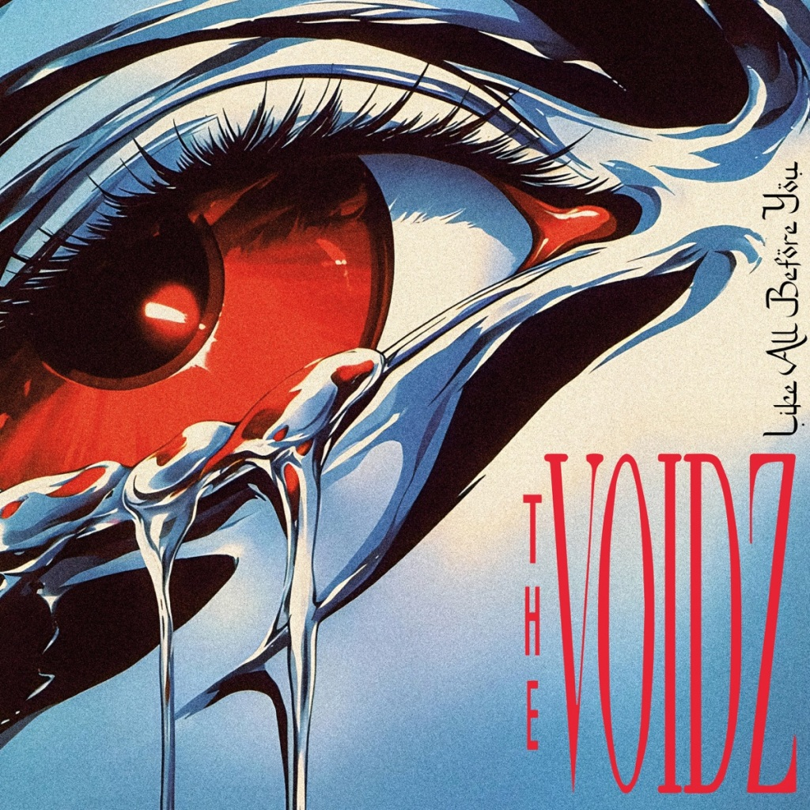
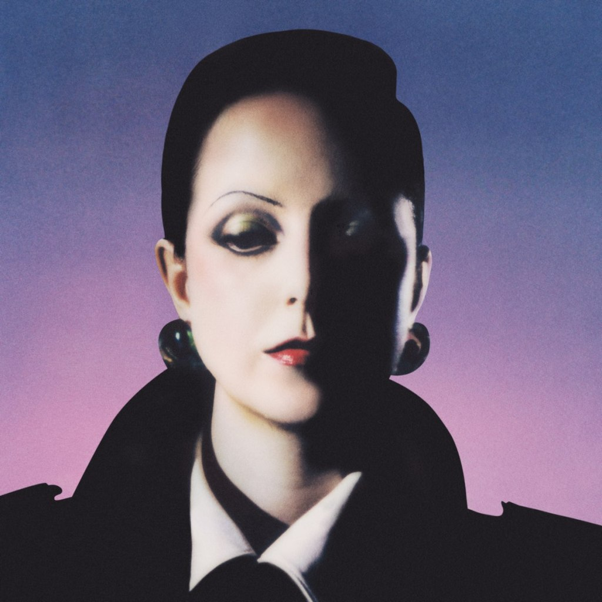
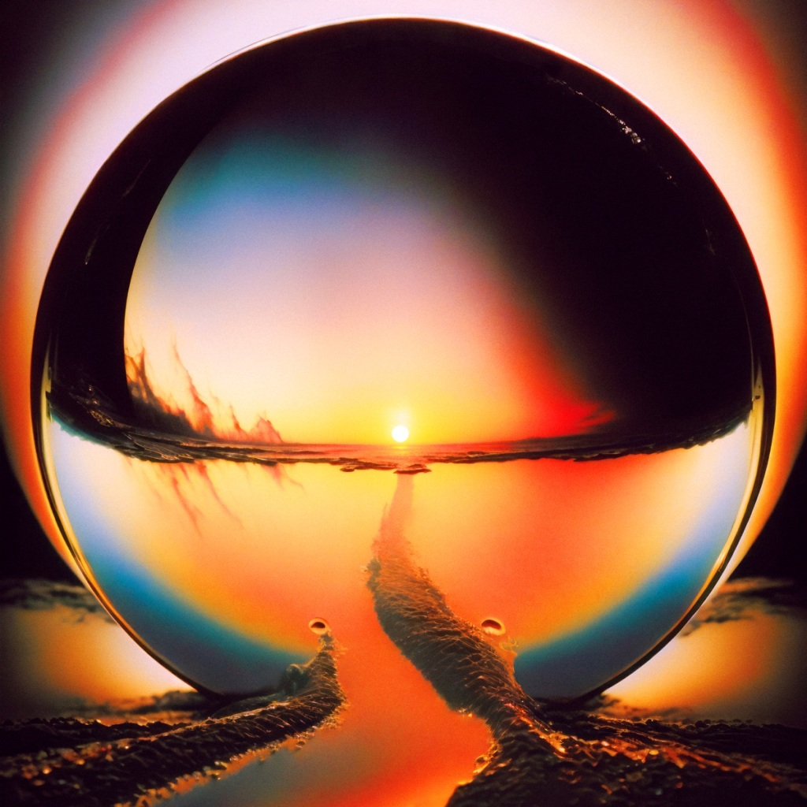
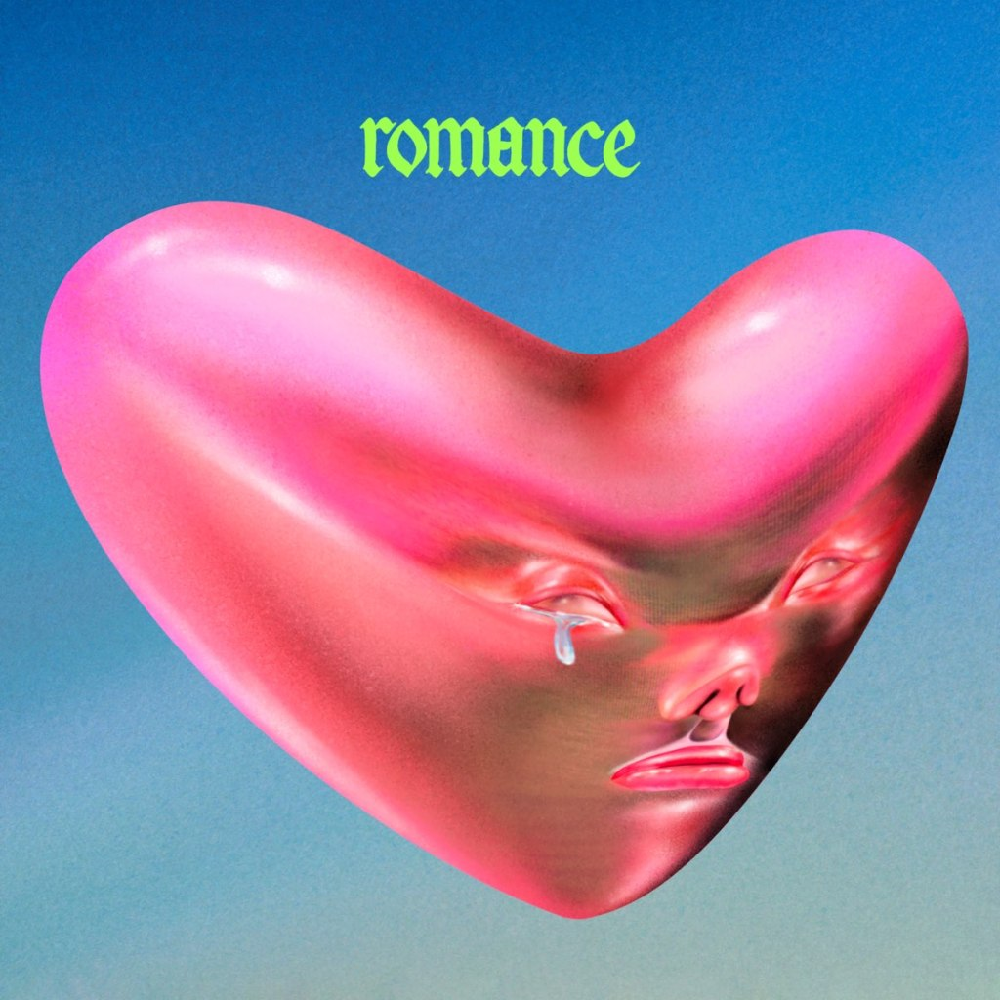
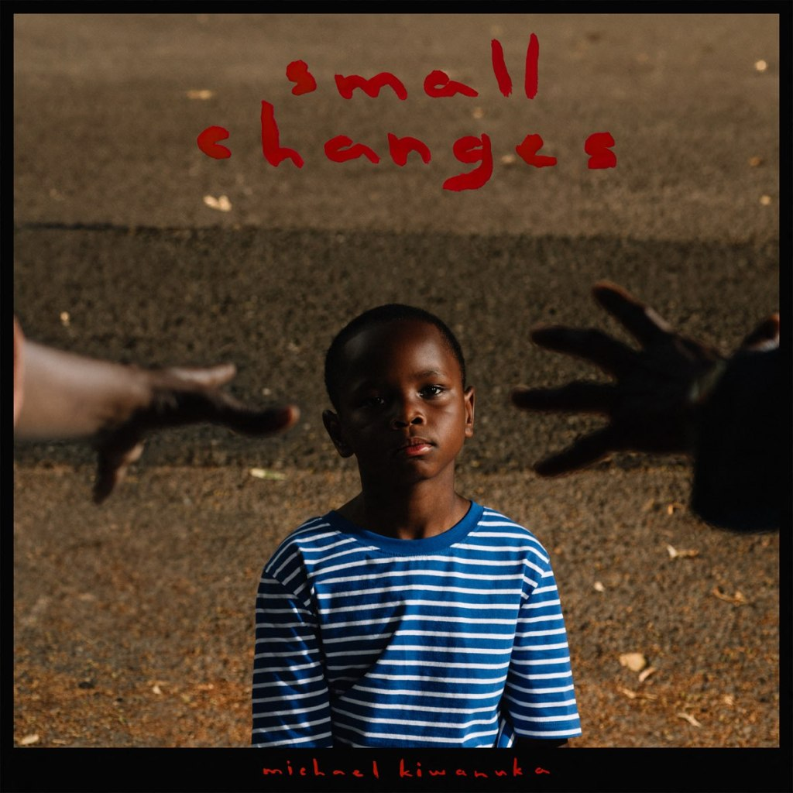
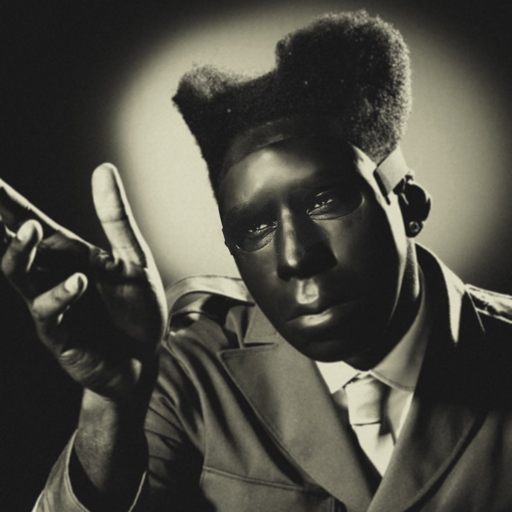
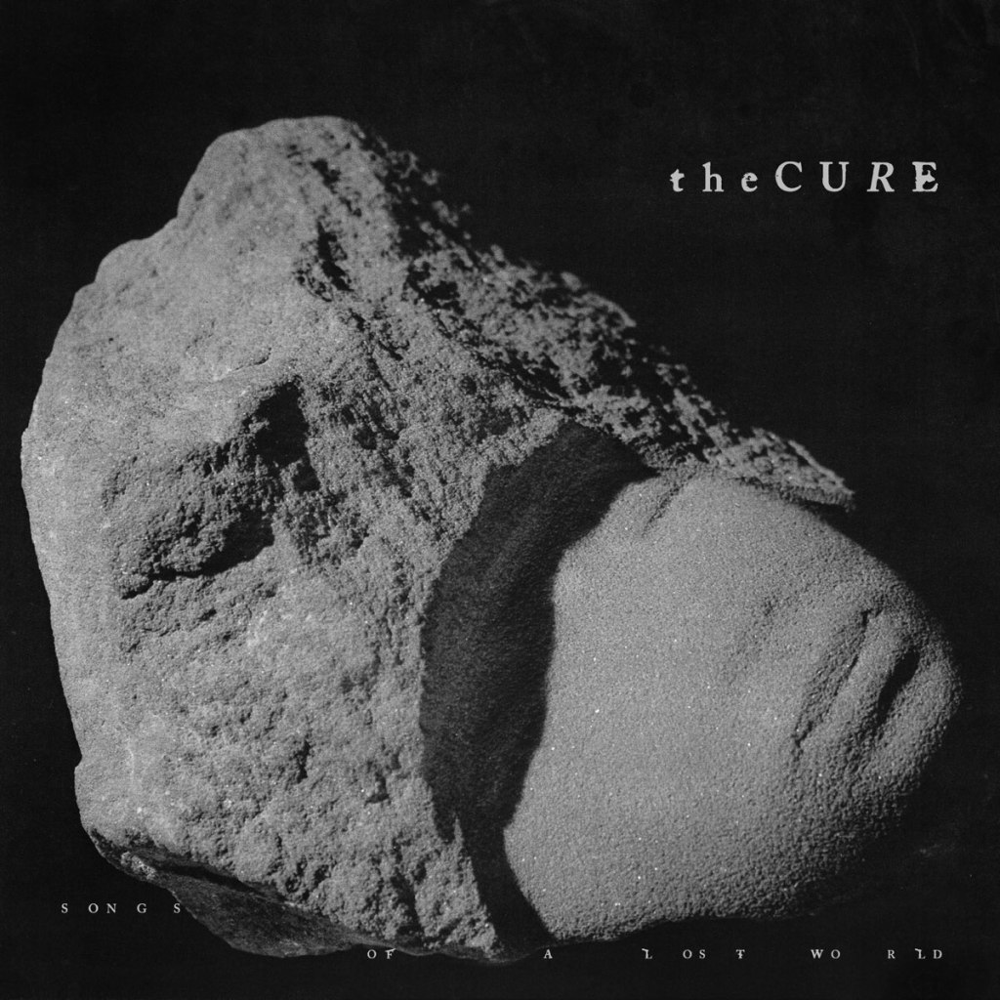
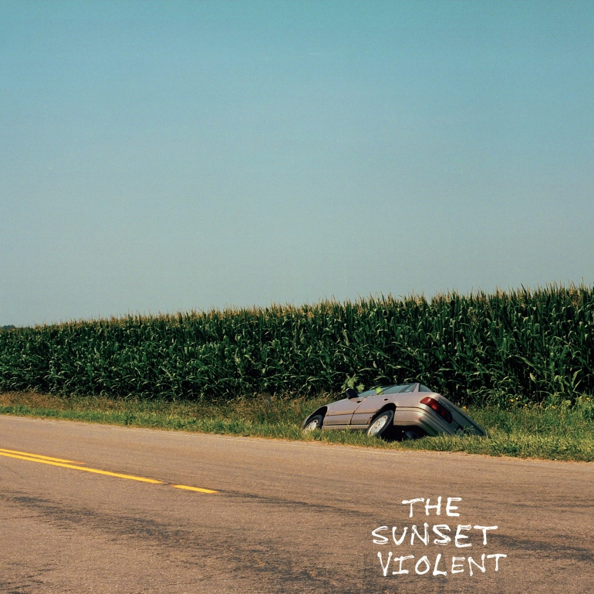
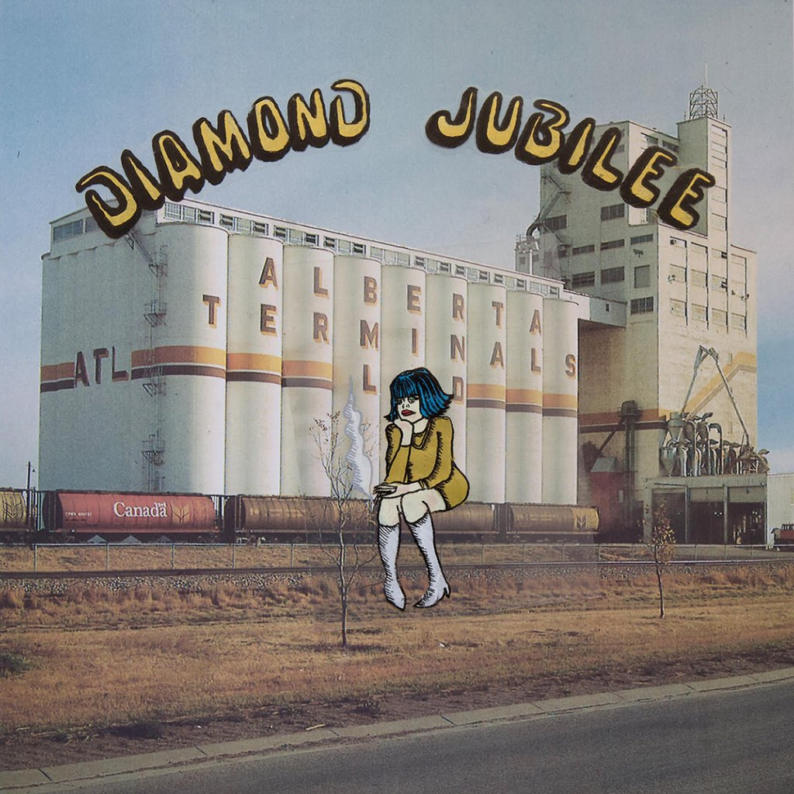
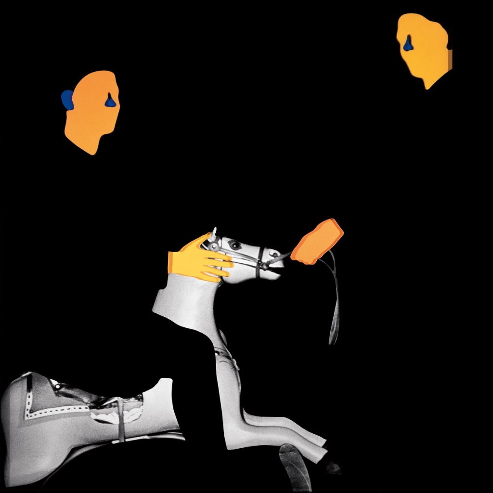

#### Comme toujours, Sonne Qui Peut prend bien son temps au beau milieu des fêtes pour publier son top albums 2024 (on guette les drops de dernière minute, les filous). Pour ceux qui me lisent (un big merci à vous) de nombreux noms présents ici auront été mentionnés dans nos récaps et chroniques tout au long de l'année. Mais quelques surprises ont pu se glisser dans le grand bilan.

<!--more-->

## 20\. Like All Before You - The Voidz

## 19\. Imaginal Disk - Magdalena Bay

## 18\. Fabiana Palladino - Fabiana Palladino

## 17\. Neon Pill - Cage The Elephant

## 16\. Chasing Moving Trains - Roy Blair

## 15\. Romance - Fontaines D.C.

## 14\. Wild Gold - Nick Cave & The Bad Seeds

## 13\. Your Day Will Come - Chanel Beads

## 12\. Red Mile - Crack Cloud

## 11\. Small Changes - Michael Kiwanuka

## 10\. PRATTS & PAIN - Royel Otis

## 9\. CHROMAKOPIA - Tyler, The Creator

## 8\. Songs Of A Lost World - The Cure

## 7\. The Sunset Violent - Mount Kimbie

## 6\. Diamond Jubilee - Cindy Lee

## 5\. BRAT - Charli XCX

## 4\. Only God Was Above Us - Vampire Weekend

## 3

# Britpop - A. G. Cook

Fut un temps où PC Music étaient vus comme de gentils weirdos, avant de détourner le regard. Onze ans plus tard, alors que son fondateur vient de mettre un terme à l'aventure, on célèbre son héritage. A. G. Cook le premier, qui sort l'un des albums les plus fous de l'année, Britpop. Comme un long mix évolutif, l'imposant triple disque navigue entre célébration des années hyperpop, avant de mieux basculer vers un présent et un futur où les compositions se font plus lentes, plus vocales, mais toujours habitées par ces pulsions synthétiques qui font dérailler la machine pop.

## 2

# Loss Of Life - MGMT

Boudé des tops et médiatiquement peu existant, on pourrait croire qu'aucun album de MGMT n'est sorti cette année. Est-ce un signe que les désormais quadragénaires, ex idoles des indie kids fin 2000 / début 2010, sont devenus has been ? Absolument pas. Notre duo vient, par on ne sait quelle sorcellerie, ajouter un nouvelle pièce au puzzle, ici une discographie proche de la perfection. Moins démonstratif que son prédécesseur, Loss Of Life s'avère pour autant plus intense et subtil que jamais. Et définitivement indispensable.

## **1**

# Two Stars & The Dream Police - Mk.gee

Il fallait frapper vraiment très fort, pour qu'un newcomer (ou presque) puisse se faufiler jusqu'à la première place de notre top albums 2024. Mais que voulez-vous, Two Star & The Dream Police fait partie de ces disques auxquels on était pas préparé émotionnellement, et qui frappa à la porte un soir de février, accompagné de ses douze titres dont aucun n'est à a jeter. De l'intensité des ses compos, son jeu de guitare, à cette esthétique pleine de spleen et ce son aussi bien rétro que futuriste, Mk.gee s'est révélé avec un classique instantané.

## Tous les artistes du top albums 2024 sont à retrouver dans notre playlist annuelle

https://open.spotify.com/playlist/0kmHfJykK3eSXtA7grVDYC?si=9ef83e7e42724708
